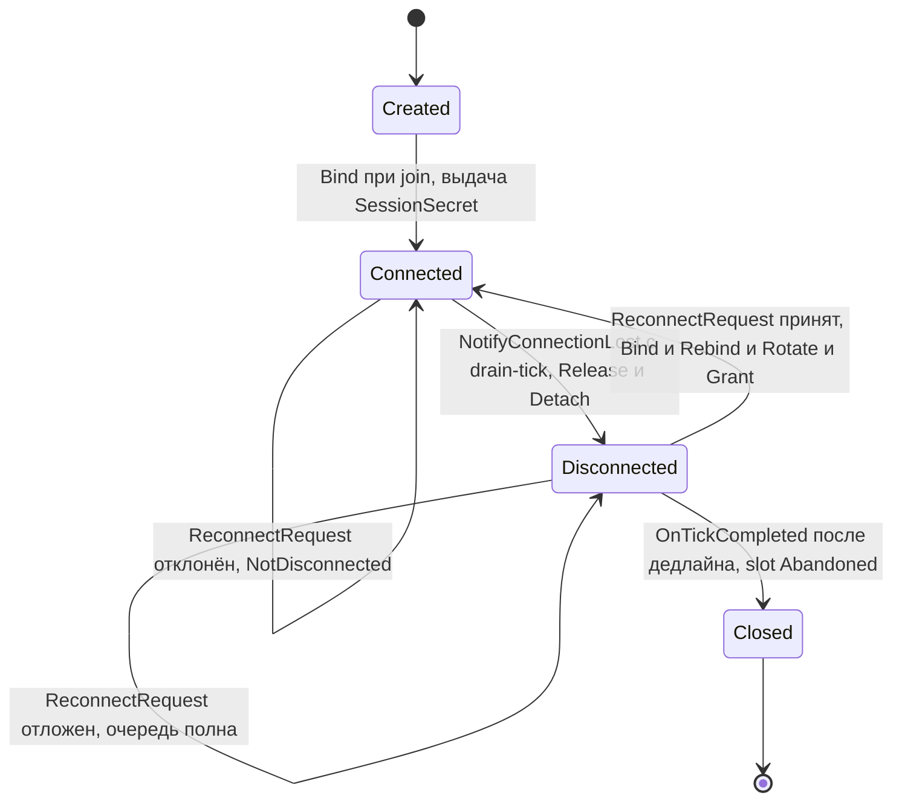
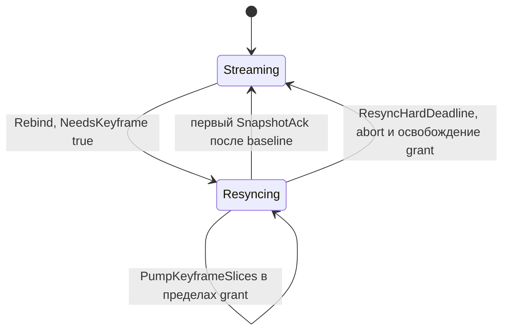
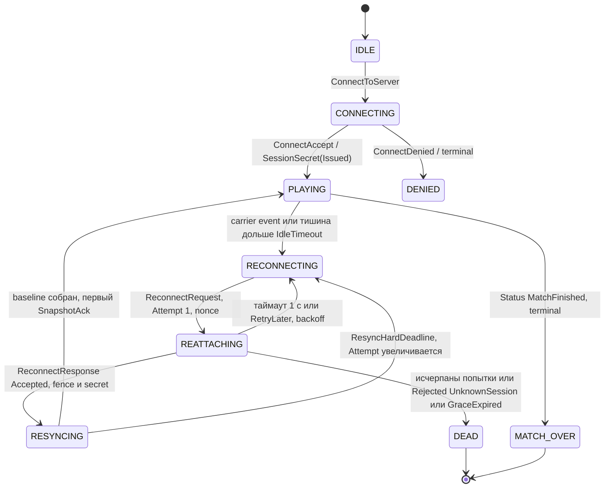
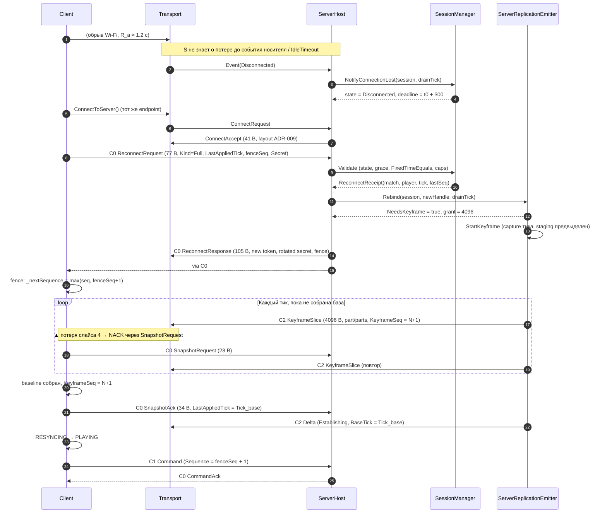
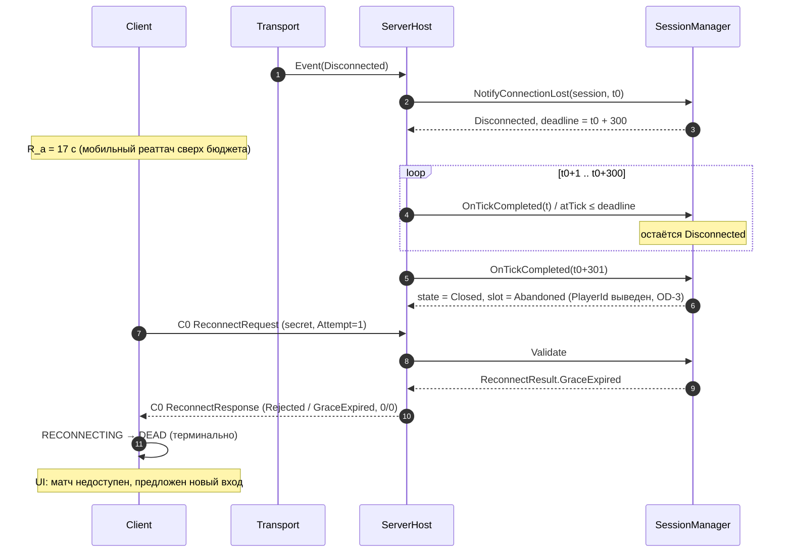
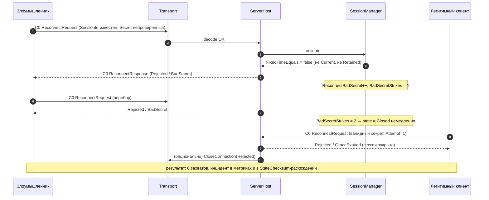

# Phase 2.7 — Reconnect & Resync: R&D Report

> Статус: R&D Report — Revision 2 • Decisions Accepted (ADR-011: Accepted)
> Базис: ADR-007 (tick driver), ADR-008 (session/identity), ADR-009 (transport, LiteNetLib 1.3.5), ADR-010 (Delta Snapshot Protocol: Establishing Deltas, кольцо 120 тиков, sliced keyframe, rate-pacing, 10 Hz `SnapshotAck`), ADR-011 (Reconnect & Resync Architecture: Tactical Pause 200s, command queue preservation, keyframe resync with 5s countdown, 32-byte SessionSecret).
> Верифицированный baseline: **599/599 EditMode** (`EditModeTestResults.xml`, 2026-09-07), **6/6 PlayMode** (`Artifacts/TestResults/playmode-phase26-step4.xml`, 2026-09-04), HEAD `54b82eb`.
> Архитектурные решения OD-18…OD-22 утверждены владельцем и закреплены в ADR-011.

---

## 0. Executive Summary

Сценарий §2 существует уже частично: `SessionManager` (ADR-008) знает состояние `Disconnected` и окно `DisconnectGraceTicks` (OD-2), `ReconnectResult` и `ReconnectReceipt` определены. Однако **контура восстановления нет**: транспорт при потере соединения немедленно вызывает `TransportSessionBinder.Release(session)` и роняет атрибуцию, а `SessionManager.OnTickCompleted` закрывает сессию по истечении grace.

Владелец утвердил архитектуру ADR-011 (OD-18…OD-22), базирующуюся на Generals-Style тактической паузе, сохранении очереди команд и безопасном ключевом ресинке:

| # | Решение | Утверждённое решение владельца (ADR-011: Accepted) |
|---|---|---|
| 1 | Tactical Pause (OD-18) | **Generals-Style Tactical Pause:** 200.0 секунд на каждый дисконнект. При обрыве связи серверная симуляция замирает (`TickDriver` останавливает расчёт тиков), у всех игроков появляется экран ожидания с синхронным таймером на 200с. Мир не тикает, автономия юнитов не мутирует мир. |
| 2 | Сохранение команд (OD-19) | **Сохранение очереди приказов:** Так как симуляция находилась на паузе, очередь приказов (`CommandQueue`) сохраняется и возобновляется после снятия паузы. Приказы не сбрасываются. |
| 3 | Resync + 5с отсчёт (OD-20) | **Resync застывшего мира:** Возвращающийся игрок скачивает Keyframe застывшего мира. После подтверждения готовности у всех игроков на экране запускается 5-секундный отсчёт перед возобновлением симуляции. |
| 4 | Anti-Hijacking (OD-21) | **32-байтный `SessionSecret`:** Генерируется сервером, автоматически кэшируется клиентом (без ручного ввода), валидация строго через `FixedTimeEquals`. Сообщения: `ReconnectRequest` (opcode 12, 64 B), `ReconnectResponse` (opcode 13, 92 B), `SessionSecretMessage` (opcode 9, 33 B). |
| 5 | Дефекты D1–D6 (OD-22) | Закрытие шести дефектов baseline: D1 (drain-tick), D2 (монотонный `NextKeyframeSeq`), D3 (`DefaultMaxClients = 10`), D4 (депривация `hasResumeSession`), D5 (grace window), D6 (предвыделенный буфер 117 КБ). |

## 1. Верифицированный технический базис

Факты проверены по репозиторию (code + docs, сентябрь 2026):

- **Симуляция**: `SimulationConstants.ServerTickRate = 20`, `MaxPlayers = 10`, `AutoAcquireRangeMm = 18000`; тик = 50 ms; детерминированный integer state. Тик-фазы хоста (`LocalMatchHost.OnDriverTickDue`): `TickStarting → MatchServer.TickOnce → TickCompleted (=Emitter.OnTickCompleted) → SessionManager.OnTickCompleted(tick)`.
- **Сессии (ADR-008)**: `SessionState { Created, Connected, Disconnected, Closed }`; `PlayerConnectionState { Assigned, Connected, Disconnected, Abandoned }`; `MatchPhase { Forming, Running, Finished, Closed(reserved) }`; `ConnectionHandle` — opaque `ulong`, `Value == 0` = «нет соединения», выдаётся монотонно (`_nextConnectionValue = 1`); `SessionId`/`MatchId` — Guid-backed; `ReconnectResult { Reconnected, UnknownSession, SessionClosed, NotDisconnected, GraceExpired }`; `ReconnectReceipt { Match, Player, CurrentTick, LastAcceptedSequence }`; `SessionManager.OnTickCompleted(tick)` закрывает сессию при `tick > DisconnectedAtTick + _disconnectGraceTicks` и переводит слот в `Abandoned`.
- **Транспорт (ADR-009)**: `TransportChannel { Control = 0, Command = 1, Snapshot = 2 }`; `TransportMessageType` заканчивается на `ReplicationRequest = 11`; message-заголовок = 13 B (`Magic u16`, `MessageVersion u16 = 1`, `MessageType u8`, `SessionToken u64`), C2 добавляет `SnapshotTick u64`; `MessageCodec.ConnectRequestSize = 4 + 1 + 16`, `ConnectAcceptSize = 8 + 16 + 16 + 1 = 41`; `ConnectDenyReason { None, MessageVersionMismatch, SnapshotVersionMismatch, ServerFull, Internal }`; `TransportProtocol.HandshakeToken = 0`; `IdleTimeoutMs = 5000`; `KeepaliveIntervalMs = 1000`; `RateLimitPacketsPerSecond = 200`, `RateLimitBytesPerSecond = 256 KB`; `MaxConnections = 64`; `MaxMessageBytes = 1 MB`; `MaxDatagramBytes = 1200`.
- **Атрибуция**: `TransportSessionBinder.Bind(...)` выдаёт 64-битный crypto-random токен (`RandomNumberGenerator`) и хранит `token → { Handle, SessionId, MatchId, PlayerId, ConnectionId }`; `Release(session)` удаляет биндинг; `ServerTransportHost` для каждого входящего сообщения требует `binding.ConnectionId == transportEvent.ConnectionId`.
- **Репликация (ADR-010)**: `DeltaSnapshotProtocol { Version = 1, MessageTypeDelta = 0x03, HeaderSizeBytes = 36, MaxPayloadBytes = 8192, AddRecordSizeBytes = 39, MaxPacketBytes = 8236 }`; `KeyframeSliceCodec { SliceVersion = 1, HeaderSizeBytes = 24, MessageType = 0x02 }`; `SnapshotAckCodec { MessageType = 0x05, SizeBytes = 34 }`; `ReplicationRequestCodec { MessageType = 0x06, SizeBytes = 28 }`; `ReplicationHistoryRing.Capacity = 120`; `ServerReplicationEmitterConfig { DefaultPacingRefillBytesPerTick = 2048, DefaultPacingBurstCapBytes = 16384, DefaultMaxSlicePayloadBytes = 16384, DefaultIdleKeepAliveTicks = 20, DefaultChecksumIntervalTicks = 20 }`.
- **Авторитет команд**: `MatchServer.ValidateCommonHeader` отвергает `header.Sequence <= lastSequence` как `MatchCommandRejection.DuplicateSequence`; `CommitSequence` вызывается **только после успешной постановки в расписание**, поэтому `TryGetLastAcceptedSequence(player)` — истинный последний *принятый* sequence; `AcceptedPastTicks = 20`, `AcceptedFutureTicks = 60`.
- **Автономия юнита**: `UnitRecord.AutoAcquireEnemies` — пер-юнит флаг, реплицируемый полем `AutoAcquire` (R&D Phase 2.6 §6.3); `MatchServer.AcquireAutomaticTargets()` назначает цель только юнитам с `AutoAcquireEnemies && !HasAttackTarget` в радиусе `AutoAcquireRangeMm`; `ExecuteMove` ставит `AutoAcquireEnemies = false` и `ClearTarget()`, `ExecuteAttack` ставит `true`, `ExecuteStop` флаг не трогает.
- **Ограничения, релевантные 2.7**: 2.5/2.6 явно вынесли reconnect/resync в Phase 2.7; `MatchServer`, `TickDriver`, session-gate, `CommandHeader` и Snapshot Protocol v1 не изменяются без отдельного ADR; шифрование/подпись пакетов отложены (OD-15).

### 1.1. Дефекты baseline, обнаруженные при этом исследовании (обязательны к закрытию в 2.7)

Эти факты обязаны быть закрыты в рамках 2.7 (см. шаги §11), иначе reconnect либо не заработает, либо будет небезопасен:

| # | Факт в коде | Последствие для 2.7 |
|---|---|---|
| **D1** | `ServerTransportHost.Pump(long nowMs)` при обработке потери соединения передаёт `_server.CurrentTick`, тогда как `SessionManager.OnTickCompleted` использует аргумент `tick` | В фазе `TickStarting(T)` поле `MatchServer.CurrentTick` ещё равно `T−1`. `DisconnectedAtTick` фиксируется на тик раньше и окно grace становится зависимым от фазы опроса, а не от тик-контракта. Требуется явный **drain-tick** (§7.1) |
| **D2** | `ServerReplicationEmitter.OnSessionAttached` при повторном прикреплении того же `SessionId` заново обнуляет `NextKeyframeSeq = 0` | Поколение keyframe перестаёт быть монотонным по сессии: устаревший `KeyframeRef` клиента может совпасть с новым поколением. Требуется `Rebind`, сохраняющий `NextKeyframeSeq` и `LastKeyframeTick` (§5.5) |
| **D3** | `ServerReplicationEmitterConfig.DefaultMaxClients = 8`, тогда как `SimulationConstants.MaxPlayers = 10` | В матче 5v5 девятый и десятый клиенты не получают репликацию вообще (комментарий в коде: «replication simply never starts for it»). Требуется `DefaultMaxClients = SimulationConstants.MaxPlayers` (§7.6) |
| **D4** | `MessageCodec.EncodeConnectRequest` уже несёт спящий флаг `hasResumeSession` + 16-байтный `resumeSession` (Guid), а `ConnectAccept` его не использует | Возникают два конкурирующих «resume»-механизма. Требуется явная депривация поля в 2.7 (§4.3), чтобы семантика была одна |
| **D5** | `LocalMatchHost.DefaultDisconnectGraceTicks = 100` (5 с) | `D5 ≤ TransportProtocol.IdleTimeoutMs = 5000`: бюджет клиента на реаттач становится неположительным — ровно в том сценарии (LTE), ради которого grace существует. Требуется 300 тиков (§6.3) |
| **D6** | `ServerReplicationEmitter.StartKeyframe` лениво выделяет `client.KeyframeStaging = new byte[Math.Max(stagingBytes, 64)]` под полный keyframe (117 КБ при N = 3000) | Ровно в момент возврата игрока возникает одна крупная аллокация LOH-размера — GC-спайк в тик-цикле, то есть «лаг у остальных 9», против которого и написана эта фаза. Требуется предвыделение (§5.5) |

## 2. Математика проблемы (постановка)

Обозначения: `T_rate = 20 Hz` — тик-рейт; `G` — grace в тиках; `D` — задержка **серверного** обнаружения потери; `R_a` — время реаттача клиента (радио/NAT rebinding); `R_r` — retry-бюджет reconnect-запросов; `K = 16 + 39·N` — размер keyframe; `W = 120` — окно истории ADR-010; `S` — размер resync-слайса; `B_g` — глобальный resync-бюджет на тик.

```text
Дедлайн приёма reconnect:             T_deadline = t0 + D + G                    (1)
Условие успеха:                       R_a + R_r  ≤  D + G                       (2)
Худший случай по запасу grace:        D = 0  ⇒  G ≥ R_a + R_r                   (3)
Пользовательская задержка возврата:   T_recover ≈ D + ceil(K / B_g) / T_rate     (4)
Отсечение in-flight команд:           fenceTick = CurrentTick (на момент rebind)  (5)
```

Ключевой вывод из (2)–(3): `D` не «съедает» окно, а **сдвигает его начало вправо** (сервер узнаёт о потере лишь тогда, когда сообщает носитель), поэтому для *достаточности* grace критичен не `D = 5000`, а противоположный край — `D = 0`, когда носитель сообщает об ошибке немедленно (`RST`, `ICMP port unreachable`, локальный socket reset). Именно в этом случае дедлайн равен `t0 + G`, и вся задержка клиента ложится на grace:

```text
G = 100 тиков (5 с),  D = 0  ⇒  бюджет 5.0 с   против клиентского p99 ≈ 12 с  — отказ
G = 300 тиков (15 с), D = 0  ⇒  бюджет 15.0 с  против клиентского p99 ≈ 12 с  — запас 1.25×
G = 300 тиков (15 с), D = 5 с ⇒  бюджет 20.0 с против клиентского p99 ≈ 12 с  — запас 1.67×
```

Именно поэтому целевой оценки `D ≈ 5 с` недостаточно в качестве оправдания короткого окна: при быстром обнаружении `G` остаётся единственным запасом. Детальный бюджет клиента приведён в §6.3.

Бюджет round-trip'ов восстановления (payload'ы — §3.1/§3.2): запрос `64 B` + заголовок `13 B` = **77 B**; ответ `92 B` + `13 B` = **105 B**; полный обмен = **182 B**. С учётом ARQ C0 и до 4 попыток верхняя граница ≈ `4 × 182 = 728 B` — пренебрежимо против ingress-лимита `256 КБ/с` (запас ≈ ×350) и против `RateLimitPacketsPerSecond = 200`.

Стоимость удержания слота в grace: `0` вычислений симуляции (мир тикает без игрока), `1` запись в `SessionManager` (≈ 40 B managed) и **0 B дополнительной памяти репликации**: `ReplicationHistoryRing` (120 тиков) уже существует и общий для всех клиентов, а очередь отложенных пакетов отсутствующего клиента отбрасывается (§4, §7). Единственный реально растущий ресурс — staging-буфер будущего keyframe (§5.5, дефект D6).

## 3. Вопрос 1 — Anti-Hijacking Token: почему `SessionId` недостаточен

ADR-008 сознательно зафиксировал: «until authentication exists, the SessionId is also the reconnect identity handle (OD-4)». Phase 2.7 обязана это решение пересмотреть, потому что `SessionId` не удовлетворяет ни одному требованию к полномочию:

1. **Публичность.** `SessionId` летит в `ConnectAccept` (payload 41 B) каждому клиенту, далее попадает в `ReconnectResponse`, в диагностические срезы (`SessionRecord`), счётчики, логи и — по мере развития — в replay-заголовки и matchmaking. Значение, которое регулярно пересекает границу «наружу», не может быть носителем полномочия.
2. **Долгожительство.** `SessionId` живёт весь матч. Для партии 30 минут это означало бы 30-минутный валидный bearer-креденшел: одна утечка — вход до конца партии.
3. **Отсутствие ротации и anti-replay.** У `SessionId` нет ни версии, ни срока годности; повторное использование значения из записи трафика или лога неотличимо от легитимного реаттача.
4. **Отсутствие константного времени.** `Guid.Equals` сравнивает байты с ранним выходом — для секрета это неприемлемо.
5. **Дуальность ролей.** `SessionToken` (64-bit, ADR-009) — второй bearer-креденшел с той же природой, и он тоже не ротируется. Два независимых долгоживущих идентификатора в одном контуре — это две возможности ошибиться.
6. **RTS-специфика цены ошибки.** Захват слота отдаёт атакующему армию, экономику и позицию игрока. В RTS цена hijacking не «повторный вход», а проигранный матч.

Отсюда требование: полномочие должно быть **высокоэнтропийным, непубликуемым, ротируемым, одноразовым, сравниваемым в константном времени и с ограниченным окном реплея**. Этому удовлетворяет `ReconnectSecret` (§3.4), а `SessionId` сохраняет роль **идентификатора** (адресация метрик, token bucket, диагностика) и участвует в проверке только как второй фактор.

| Угроза | Без `ReconnectSecret` | С `ReconnectSecret` |
|---|---|---|
| Пассивное прослушивание C0/C1 | `SessionId`/`SessionToken` известны → вход | секрет не покидает `ReconnectRequest`/`ReconnectResponse` и ротируется на каждом успехе |
| Утечка через логи/replay | `SessionId` в логах = вход | логируется `SessionId`, никогда — секрет; хранение как `byte[16]` с явным обнулением |
| NAT rebinding (смена IP/порта) | технически возможен, но небезопасен | rebind по новому `ConnectionHandle`; handle не участвует в проверке секрета |
| Перехват и быстрый реплей | полный захват слота | retention-окно 100 тиков + одноразовость + плановый refresh 600 тиков (§3.5) |
| Активный MITM | любой bearer-креденшел ломается | **граница честности**: нужен proof-of-possession (HMAC над nonce), что требует PSK — OD-15, Phase 2.8+ (§3.6) |

### 3.1. Wire format: `ReconnectRequest` (C0, client → server)

Новый тип сообщения `TransportMessageType.ReconnectRequest = 12`; канал **C0** (новый сокет обязан отправить запрос в единственное надёжное ordered-пространство с handshake-токеном). Заголовок уровня сообщения — существующий `MessageCodec`: `Magic u16`, `MessageVersion u16`, `MessageType u8`, `SessionToken u64` = **13 B** (секрет намеренно помещён в *payload*, а не в заголовок, чтобы заголовок остался неизменным контрактом ADR-009). Payload — **64 B**, суммарно датаграмм **77 B**.

| Смещение | Размер | Тип | Поле | Семантика |
|---:|---:|---|---|---|
| 0 | 1 | `u8` | `MessageType` | `0x07` (`ReconnectRequest`; в wire-пространстве C0-payload'ов — следующий после `0x06` `ReplicationRequest`) |
| 1 | 1 | `u8` | `Kind` | `ReconnectKind`: `0 = Full` (нужен мир), `1 = KeyframeOnly` (клиент сохранил базу, нужен только свежий keyframe) |
| 2 | 1 | `u8` | `Attempt` | 1-based, `≤ MaxReconnectAttempts = 4`; диагностика и анти-спам |
| 3 | 1 | `u8` | `ProtocolCaps` | бит 0 `DeltaV1`, бит 1 `ResyncV1` (зарезервирован), биты 2..7 — reserved = 0 |
| 4 | 2 | `u16` | `RequestNonce` | per-attempt nonce; **эхо** возвращается в ответе для корреляции |
| 6 | 2 | `u16` | `Reserved0` | записано 0, при декодировании обязан быть 0 (иначе `Malformed`) |
| 8 | 8 | `u64` | `LastAppliedTick` | подтверждённый клиентом тик репликации (0 = базы нет, аналог `BaseKeyframeTick = 0` ADR-010) |
| 16 | 8 | `u64` | `LastClientCommandSequence` | последний применённый `CommandAck.CommandSequence` (0 = ни одного) |
| 24 | 8 | `u64` | `SessionIdHi` | байты 0..7 `SessionId.Value.ToByteArray()` (порядок Guid — as-is) |
| 32 | 8 | `u64` | `SessionIdLo` | байты 8..15 |
| 40 | 8 | `u64` | `SecretHi` | байты 0..7 `ReconnectSecret` |
| 48 | 8 | `u64` | `SecretLo` | байты 8..15 |
| 56 | 8 | `u64` | `MatchCheck` | FNV-1a-64 (`basis = 0xCBF29CE484222325`, `prime = 0x100000001B3`) от `MatchId.ToByteArray()` — **подсказка маршрутизации, не полномочие** |
| **64** | | | **EOF** | payload = 64 B; +13 B заголовок = **77 B** |

Почему так, а не иначе:

- `SessionId` передаётся целиком (16 B), и это не избыточно с `MatchCheck`: сервер привязывает запрос к сессии, а `MatchCheck` дешёво отсекает чужие/устаревшие централизованные маршруты без раскрытия `MatchId` в открытом виде.
- `LastAppliedTick` и `LastClientCommandSequence` — оба «прогресса» клиента. Первый даёт серверу точку отсечения дельт (ADR-010 §5.1), второй — `fenceTick` для OD-19 (§4).
- `MatchCheck` не может быть секретом (FNV-1a необратим, но `MatchId` имеет 128 бит энтропии и не подбирается); он валидируется только как *совпадение* и никогда не является основанием допуска.
- `ProtocolCaps` — точка расширения для `ResyncV1` и, при последующей реализации OD-15, для `SecretProofV1`.
- Пакет 77 B вмещается в `Response`-бюджет и не фрагментируется ни при `MaxDatagramBytes = 1200` (own carrier), ни при MTU LiteNetLib.

### 3.2. Wire format: `ReconnectResponse` (C0, server → client)

Новый тип `TransportMessageType.ReconnectResponse = 13`, канал **C0**. Заголовок `MessageCodec` = **13 B**, но с `SessionToken = TransportProtocol.HandshakeToken (0)`: ответ ещё не подтверждён соединением и не должен создавать у клиента иллюзию атрибуции. Payload — **92 B**, суммарно датаграмм **105 B**.

| Смещение | Размер | Тип | Поле | Семантика |
|---:|---:|---|---|---|
| 0 | 1 | `u8` | `MessageType` | `0x08` (`ReconnectResponse`) |
| 1 | 1 | `u8` | `Status` | `ReconnectStatus` (§3.3) |
| 2 | 1 | `u8` | `DenyReason` | `ReconnectDenyReason`; `0` при `Status = Accepted` |
| 3 | 1 | `u8` | `PlayerId` | серверный `PlayerId` (подтверждение идентичности; клиент не выбирает его) |
| 4 | 1 | `u8` | `Flags` | бит 0 `KeyframeRequired`, бит 1 `DropInFlightCommands`, бит 2 `MatchFinished`, бит 3 `SecretRotated`, биты 4..7 reserved = 0 |
| 5 | 1 | `u8` | `Attempt` | эхо `ReconnectRequest.Attempt` |
| 6 | 2 | `u16` | `RequestNonce` | эхо nonce (корреляция; дроп при несовпадении) |
| 8 | 8 | `u64` | `SessionToken` | **новый** 64-битный токен для нового соединения (0 при отказе) |
| 16 | 8 | `u64` | `MatchIdHi` | байты 0..7 `MatchId` |
| 24 | 8 | `u64` | `MatchIdLo` | байты 8..15 |
| 32 | 8 | `u64` | `CurrentTick` | текущий авторитетный тик сервера на момент rebind |
| 40 | 8 | `u64` | `LastAcceptedCommandSequence` | «забор»: клиент продолжает нумерацию строго выше (OD-19) |
| 48 | 8 | `u64` | `SecretHi` | **новый** ротированный секрет, байты 0..7 (0 при отказе) |
| 56 | 8 | `u64` | `SecretLo` | байты 8..15 |
| 64 | 2 | `u16` | `KeyframeSeqHint` | текущее поколение keyframe сервера (диагностика; 0 = ещё не выдавалось) |
| 66 | 2 | `u16` | `GraceRemainingTicks` | сколько тиков grace осталось (0 при отказе/завершении) |
| 68 | 2 | `u16` | `ReplicationCadenceHzHint` | фактическая cadence эмиттера (5/10/20) — для UI и метрик |
| 70 | 2 | `u16` | `DeltaProtocolVersion` | `DeltaSnapshotProtocol.Version` |
| 72 | 4 | `u32` | `SnapshotProtocolVersion` | `SnapshotProtocol.Version` (1) |
| 76 | 1 | `u8` | `TerminalOutcome` | исход матча по `BattleOutcomeKind` (`0 = InProgress`, `1 = Victory`, `2 = Draw`); значим только при `Status = MatchFinished`, иначе обязан быть 0 |
| 77 | 7 | `u8[7]` | `Reserved0` | записано 0, обязано быть 0 при декодировании |
| 84 | 8 | `u64` | `AppliedAtServerTick` | тик, на котором rebind завершён (диагностика сервера) |
| **92** | | | **EOF** | payload = 92 B; +13 B заголовок = **105 B** |

Инварианты:

- `Status = Accepted` ⇒ `SessionToken ≠ 0` **и** `SecretHi/Lo ≠ 0`; при отказе оба нулевые, и клиент не должен их интерпретировать.
- `Flags.SecretRotated` устанавливается **тогда и только тогда**, когда секрет в ответе отличается от присланного в запросе. Клиент обязан заменить локальную копию при установленном флаге и не менять её в противном случае.
- Ротация текущего секрета выполняется **не более одного раза за эпизод** `Disconnected → Connected`; повторные принятые запросы внутри эпизода только переотправляют текущее значение (§7.4).
- `TerminalOutcome ≠ 0` допустим только при `Status = MatchFinished`; при прочих статусах поле обязано быть 0.
- Ответ идемпотентен по `RequestNonce`: повторный ответ на то же `(SessionId, RequestNonce)` обязан быть **побайтово идентичен** (требование к retention, §3.5), чтобы клиент не «переротировал» секрет из-за ARQ-дубля.
- `Flags.DropInFlightCommands` всегда установлен при `Accepted` — это декларация политики OD-19, а не опция.
- Версии передаются в каждом ответе: клиент 2.6-поколения, случайно получивший `ReconnectResponse`, обязан отвергнуть его по несовпадению версии вместо угадывания.

### 3.3. Типы, статусы и флаги уровня протокола

Пространство типов C0-payload'ов продолжается **после** `0x06` (`ReplicationRequest`); C2-payload-пространство (`0x01`…`0x04`, ADR-010) отделено каналом и не конфликтует.

| Enum | `u8` | Значение | Семантика |
|---|---|---|---|
| `ReconnectKind` | 0 | `Full` | клиент утратил базу; требуется полный resync |
| | 1 | `KeyframeOnly` | база сохранена; нужен только свежий keyframe (лёгкий путь) |
| `ReconnectStatus` | 0 | `Accepted` | rebind выполнен, слот и `PlayerId` восстановлены |
| | 1 | `Rejected` | окончательный отказ; причина в `DenyReason` |
| | 2 | `RetryLater` | временный отказ (идёт чужой resync / перегрузка); повтор разрешён |
| | 3 | `UnknownSession` | сессия неизвестна (рестарт сервера, closed, чужой `ServerTransportHost`) |
| | 4 | `MatchFinished` | матч терминально завершён, пока игрок был вне сети |
| `ReconnectDenyReason` | 0 | `None` | при `Status = Accepted` |
| | 1 | `BadSecret` | секрет не совпал (ни текущий, ни retained) |
| | 2 | `SessionIdMismatch` | `MatchCheck`/идентичность не сходятся с сессией |
| | 3 | `NotDisconnected` | сессия не в `Disconnected` (жива или ещё не привязана) |
| | 4 | `GraceExpired` | окно истекло (`atTick > DisconnectedAtTick + GraceTicks`) |
| | 5 | `MatchNotRunning` | `MatchPhase ≠ Running` (например `Forming`) |
| | 6 | `IdentityMismatch` | слот в `Abandoned` или `PlayerId` не совпадает |
| | 7 | `ResyncQueueFull` | превышен `MaxConcurrentResyncs`, очередь не принять |
| | 8 | `RateLimited` | token bucket запросов исчерпан |
| | 9 | `ProtocolMismatch` | нет требуемой capability (`DeltaV1`) или версии несовместимы |

`ReconnectFlags` (биты 4..7 зарезервированы, установленный резервный бит ⇒ `Malformed`):

| Бит | Маска | Имя | Семантика |
|---:|---:|---|---|
| 0 | `0x01` | `KeyframeRequired` | сервер инициирует resync; клиент обязана перейти в UNBASED |
| 1 | `0x02` | `DropInFlightCommands` | зафиксирована политика OD-19: неподтверждённые команды не переотправляются |
| 2 | `0x04` | `MatchFinished` | дублирует `Status = MatchFinished` для дешёвой фильтрации |
| 3 | `0x08` | `SecretRotated` | `SecretHi/Lo` содержит новое значение |

`ReconnectCaps` (поле `ProtocolCaps`): бит 0 `DeltaV1` (обязателен для `Kind = Full`), бит 1 `ResyncV1` (резерв), биты 2..7 reserved = 0.

**Маппинг на существующий `ReconnectResult` (ADR-008)** — enum ADR-008 не изменяется, новые значения добавляются только на wire:

| `ReconnectResult` (ADR-008) | wire `Status` / `DenyReason` |
|---|---|
| `Reconnected` | `Accepted` / `None` |
| `UnknownSession` | `UnknownSession` / — |
| `SessionClosed` | `Rejected` / `GraceExpired` |
| `NotDisconnected` | `Rejected` / `NotDisconnected` |
| `GraceExpired` | `Rejected` / `GraceExpired` |

**Версионирование.** Набор сообщений — часть контракта `TransportProtocol.MessageVersion` (R&D Phase 2.5 §6.3), поэтому добавление `ReconnectRequest`/`ReconnectResponse`/`SessionSecret` требует **bump `MessageVersion` 1 → 2** с аддитивным приёмом известных v1-типов. Это единственное изменение версии в Phase 2.7; `CarrierVersion`, `SnapshotProtocol.Version` и `DeltaSnapshotProtocol.Version` не меняются.

**Канал.** Запрос идёт по C0, то есть в **общем reliable-ordered пространстве C0/C1** с cumulative+selective ACK. Следствие: запросы нельзя слать очередью (burst) — каждый занимает место в общем окне и при пакетной отправке создаёт HOL для `CommandAck`. Отсюда политика «1 запрос за раз + backoff» (§3.5).

### 3.4. Генерация, хранение и ротация `ReconnectSecret`

**Источник энтропии.** Только `System.Security.Cryptography.RandomNumberGenerator` — тот же CSPRNG, что уже используется в `TransportSessionBinder.Bind`. Запрещено: `System.Random` (не CSPRNG), `Guid.NewGuid()` (v4 имеет фиксированные version/variant-нибблы и не поддерживает обнуление), `DateTime`-производные значения. Заполнение — в предвыделенный `byte[16]` из пула (Zero-GC на rebind; пул инициализируется один раз).

**Хранение.** `SessionManager` держит на сессию: `byte[16] CurrentSecret`, `byte[16] RetainedSecret`, `ulong RetainedUntilTick`, `byte[16] ResponseImageCache` (`ReconnectResponse` payload для идемпотентного повтора) и `ulong ResponseImageNonce`. Секреты никогда не попадают в `SessionRecord` (диагностический срез), в `MatchServer` и в `ToString()`. Обнуление — `CryptographicOperations.ZeroMemory` при ротации и при `CloseSession`.

**Выдача клиенту.** `ConnectAccept` (41 B, ADR-009) **не расширяется**: его layout остаётся неизменным контрактом. Начальный секрет выдаётся отдельным C0-сообщением `SessionSecret` (payload type `0x09`), которое затем переиспользуется для планового refresh и для ротации:

| Смещение | Размер | Тип | Поле | Семантика |
|---:|---:|---|---|---|
| 0 | 1 | `u8` | `MessageType` | `0x09` (`SessionSecret`) |
| 1 | 1 | `u8` | `Kind` | `0 = Issued`, `1 = Rotated` |
| 2 | 2 | `u16` | `IssueNonce` | порядковый номер выдачи (монотонный по сессии) |
| 4 | 8 | `u64` | `IssuedAtTick` | тик выдачи |
| 12 | 2 | `u16` | `RotationIntervalTicks` | `600` (30 с при 20 Hz) |
| 14 | 2 | `u16` | `Reserved0` | 0 |
| 16 | 8 | `u64` | `SecretHi` | байты 0..7 |
| 24 | 8 | `u64` | `SecretLo` | байты 8..15 |
| **32** | | | **EOF** | payload = 32 B; +13 B = **45 B** |

**Политика ротации.**

```text
SecretRefreshTicks   = 600   (30 с; плановый refresh в состоянии Connected)
SecretRetentionTicks = 100   (5 с; окно идемпотентного повтора и допустимого реплея)
MaxConcurrentSecrets = 2     (текущий + retained, не более)
```

1. При `Bind` (join) выдаётся `Kind = Issued`; reconnect доступен немедленно.
2. При каждом успешном reconnect секрет **ротируется**: `RetainedSecret ← CurrentSecret`, `CurrentSecret ← RNG(16)`, `RetainedUntilTick ← atTick + 100`, ответ помечается `Flags.SecretRotated`. Клиент, применивший ответ, обязан заменить локальную копию (при флаге), иначе следующий reconnect не пройдёт.
3. При плановом refresh (каждые 600 тиков в `Connected`) высылается `Kind = Rotated` с тем же правилом retention. Это ограничивает ценность перехвата: захваченный секрет живёт не «до конца матча», а не более 30 с и теряет силу после первой успешной ротации.
4. Retention **строго меньше grace** (`100 < 300`): retention ограничивает реплей, grace — идентичность. Пересечение смыслов исключено конструктивно.
5. В `Disconnected` ротация приостанавливается (нет соединения для доставки); retained-секрет сохраняет силу до `RetainedUntilTick`, затем валиден только `CurrentSecret`.
6. Стоимость: `45 B / 30 с = 1.5 B/s` на клиента — в пределах шума против `DefaultIdleKeepAliveTicks`-трафика эмиттера.

### 3.5. Валидация: константное время, retention-окно и идемпотентность

Обработка `ReconnectRequest` детерминирована и полностью локализована в pump-фазе хоста (между `TickCompleted` и `SessionManager.OnTickCompleted`), то есть атомарна относительно тик-границы.

1. **Структурное декодирование** `ReconnectRequestCodec.TryDecode` (Span-кодек, Zero-GC). `Malformed` / `BufferTooSmall` / неизвестный `Kind` / установленные reserved-биты ⇒ тихий drop + `ReconnectMalformed`.
2. **Анти-спам**: token bucket на `SessionId` и на endpoint-источник, `capacity = 4`, refill `1 / 500 ms` (устойчиво ≤ 2 req/s). Превышение ⇒ `Status = RetryLater`, `DenyReason = RateLimited`; повторные нарушения — эскалация к disconnect-пути.
3. **Поиск сессии** по `SessionId`. Промах ⇒ `Status = UnknownSession` (причина не детализируется — не даём оракула).
4. **`MatchCheck`** не совпал ⇒ тихий drop + `ReconnectMatchMismatch` (поле — подсказка маршрутизации; ни один путь допуска от него не зависит).
5. **Гейт состояния**: не `Disconnected` ⇒ `Rejected / NotDisconnected`; `Closed` ⇒ `Rejected / GraceExpired`; `MatchPhase = Finished` ⇒ `Status = MatchFinished` (+ `Flags.MatchFinished`); `MatchPhase = Forming` ⇒ `Rejected / MatchNotRunning`.
6. **Гейт grace** по drain-tick (§7.1): `atTick > DisconnectedAtTick + GraceTicks` ⇒ `Rejected / GraceExpired`, сессия закрывается. **Ничья выигрывается grace**: `atTick == DisconnectedAtTick + GraceTicks` ⇒ допустимо.
7. **Валидация секрета** (константное время): собрать 16-байтные span'ы и сравнить `CryptographicOperations.FixedTimeEquals` с `CurrentSecret`; при несовпадении — с `RetainedSecret`, только если `nowTick <= RetainedUntilTick`. Оба не совпали ⇒ `Rejected / BadSecret` + `ReconnectBadSecret`; **два** несовпадения подряд по одной сессии ⇒ немедленное закрытие сессии (анти-оракул и анти-брутфорс).
8. **Гейт capabilities**: для `Kind = Full` требуется `ProtocolCaps.DeltaV1`; иначе `Rejected / ProtocolMismatch`.
9. **Гейт конфликта**: если новая попытка приходит с **того же** соединения, что уже выполнило rebind, и `(SessionId, RequestNonce)` совпадает с кэшем ⇒ отдаётся **побайтово тот же** ответ из `ResponseImageCache` (идемпотентность ARQ-дубля). Если соединение **другое**, а resync уже идёт ⇒ `Status = RetryLater` + `ReconnectDuplicateConnection` (авторитетная привязка остаётся у первого соединения).
10. **Приём**: выдать новый `ConnectionHandle`, вызвать `TransportSessionBinder.Bind` (новый токен), ротировать секрет, `StopResyncing`/`Rebind` эмиттера (§5.5), применить fence (OD-19: §4), собрать образ ответа, положить в `ResponseImageCache`, отправить по C0, снять сессию с учёта grace (state → `Connected`, слот → `Connected`).
11. **Метрики**: `ReconnectAccepted`, `ReconnectRejectedByReason[10]`, `ReconnectLatencyTicks = AppliedAtServerTick − DisconnectedAtTick`, `ReconnectRetryTicks`, `ReconnectBadSecret`, `ReconnectDuplicateConnection`.

Инварианты: (а) `ReconnectSecret` никогда не сравнивается через `Equals`/`SequenceEqual` (ранний выход = тайминг-оракул); (б) `ResponseImageCache` живёт ровно `SecretRetentionTicks`, после чего обнуляется; (в) ни на одном шаге не мутируется состояние `MatchServer` — rebind не является событием симуляции (ADR-008 firewall).

### 3.6. Остаточный риск и граница честности

Схема с `ReconnectSecret` остаётся **bearer-credential** схемой: предъявитель секрета получает слот. Это не скрывается, а нормируется:

- Кто может выиграть: атакующий с активным MITM внутри окна `(D, G)`, сумевший опередить легитимного клиента. Требуется одновременно: скомпрометированный канал, знание `SessionId` (публикуем), корректный `MatchCheck`, латентность ниже клиентской.
- Что ограничивает ущерб: (1) ротация на каждом успехе делает перехват одноразовым в буквальном смысле; (2) плановый refresh каждые 600 тиков ограничивает возраст рабочего секрета 30 секундами; (3) retention 100 тиков ограничивает окно реплея; (4) проигравший легитимный клиент получает `RetryLater` и однозначный UI-сигнал, а не молчаливую потерю слота; (5) инцидент всегда виден в метриках (`ReconnectDuplicateConnection`, `ReconnectBadSecret`) и в `StateChecksum`-расхождении (§7.4 ADR-010).
- Что принципиально **не** решается в 2.7: proof-of-possession. Корректное решение — HMAC-SHA256 над каноническим подмножеством полей (`SessionId`, `MatchCheck`, `RequestNonce`, `Attempt`, `ProtocolCaps`) с PSK, выданным на этапе авторизации матча. Это аддитивно (`ProtocolCaps.SecretProofV1` + `HasProof`-флаг и +32 B в payload) и должно быть выполнено вместе с OD-15 (шифрование) в Phase 2.8+, когда появится контур аутентификации аккаунтов.
- Отдельно: 2.7 не претендует на конфиденциальность C2-трафика, защиту от DDoS и защиту от читерства по состоянию мира (это FoW/анти-чит граница OD-16 и отдельные фазы).

Итоговая позиция: 2.7 повышает планку с «знаешь `SessionId` — входишь» до «знаешь одноразовый ротируемый секрет, попал в 5-секундное окно реплея и опередил владельца», что является максимально достижимым без PSK и **не блокирует** последующий переход к proof-of-possession.

## 4. Вопрос 2 — Дедупликация команд (OD-19) и сброс каналов C1

При пересоздании сокета LiteNetLib создаёт новый `NetPeer`, поэтому sequence-пространства надёжных каналов начинаются заново. В проекте одновременно существуют **три разных** понятия «последовательности», и смешение любых двух из них — источник ошибок:

| Пространство | Носитель | Область действия | Поведение при reconnect |
|---|---|---|---|
| Номер пакета носителя (`EnvelopeCodec.Sequence u16`, `ReceiveWindow = 1024`; внутренняя нумерация LiteNetLib) | carrier | одно соединение (`ConnectionHandle`) | **сбрасывается** — это ожидаемо и безвредно |
| `CommandHeader.Sequence` (`u32`) | `MatchServer._lastSequenceByPlayer` | один `PlayerId` в рамках матча | **обязан сохраняться**; уникален и монотонен на всю партию |
| `Tick` / `SnapshotTick` (C2 payload) | симуляция | матч | не затрагивается reconnect'ом |

Из таблицы следует главный вывод раздела: **корректность дедупликации команд уже не зависит от транспорта**. `MatchServer.ValidateCommonHeader` отвергает `Sequence <= lastAccepted` как `DuplicateSequence`, а `CommitSequence` фиксирует только *принятые* команды. Это свойство ADR-008/ADR-010 сохраняется при rebind без единой правки, и именно поэтому Phase 2.7 обязана **не вводить** никакой дедупликации, опирающейся на транспортные sequence-номера: любая такая зависимость неизбежно ломается на новом сокете.

Реальные опасности — три:

- **H1 (заморозка игрока).** Если клиент на новом сокете начнёт локальную нумерацию заново, каждая команда получит `Sequence ≤ lastAccepted` и будет вечно отвергаться как `DuplicateSequence`. Игрок вернётся в матч, но не сможет управлять войсками — при этом ни одной ошибки в логе не будет. Это самый вероятный отказ реализации, поэтому политика обязана задавать подъём счётчика явно (§4.1).
- **H2 (тихая потеря или тихое дублирование).** Команда, отправленная перед обрывом, могла быть принята и исполнена, а `CommandAck` — потерян. Клиент не может отличить «не дошло» от «дошло, ответ потерян». Любая схема «досылаю после возврата» обязана опираться только на `DuplicateSequence`, иначе она либо теряет команду, либо исполняет её дважды.
- **H3 (исполнение «в пустоту»).** Команды планируются в будущее окно (`AcceptedFutureTicks = 60`, до 3 с). Уже принятые команды выполнятся, пока игрок вне сети, — от замысла, который игрок выдал. Отменить их без отката мира нельзя, поэтому политика обязана определить, что происходит с ещё не исполненными (§4.1).

Отдельно фиксируется разграничение ответственности: `ConnectionHandle` — **транспортный** цикл (одно соединение; создаётся на rebind, `Value = 0` = нет соединения), `SessionId` — **логический** цикл (переживает grace), `PlayerId` — **игровой** цикл (живёт, пока матч `Running`; никогда не переиспользуется, OD-3). Reconnect меняет только первый.

### 4.1. Политика OD-19: fence, запрет переотправки и серверный prune

**OD-19 (рекомендация): fence + запрет переотправки.**

```text
fenceTick      = ReconnectResponse.CurrentTick            (серверный, авторитетный)
fenceSequence  = ReconnectResponse.LastAcceptedCommandSequence
client._nextSequence := max(client._nextSequence, fenceSequence + 1)   (H1 закрыт)
pruneПравило   = снять запланированные команды игрока с RequestedTick > fenceTick
```

Правила, обязательные к реализации:

1. **Счётчик не сбрасывается.** `ClientTransportEndpoint`/`NetworkCommandChannel` хранят `_nextSequence` вне жизненного цикла сокета. Подъём до `fenceSequence + 1` — единственная точка, где он может измениться при reconnect, и только вверх.
2. **Неподтверждённые команды сбрасываются.** Всё, что отправлено и не получило `CommandAckPayload` к моменту потери связи, отбрасывается без переотправки. Причина: за `G` тиков мир ушёл вперёд, а `RequestedTick` таких команд уже вне `AcceptedPastTicks = 20` (1 с) — они структурно отвергаются как `HeaderRejected`. Переотправка создаёт видимость работы, но не приносит пользы.
3. **Локальные намерения игрока переигрываются заново.** Не отправленные намерения (очередь UI) остаются у клиента и переиздаются с **новыми** sequence-номерами и **новым** `RequestedTick` относительно известного `CurrentTick`. Это не «досыл», а новая команда.
4. **Серверный prune.** При rebind применяется `MatchServer.PruneScheduledCommandsForPlayer(player, fromTickExclusive = fenceTick)` (аддитивный метод) — снимаются только команды с `RequestedTick > fenceTick`. Уже исполненные и исполняемые в `fenceTick` остаются: мир не откатывается.
5. **Детерминизм prune'а.** prune применяется внутри pump-фазы в тик-границе и является функцией пары «состояние тика + множество событий соединения» — того же класса входных данных, что и `TickStarting`-команды ADR-007. Откат мира не требуется и не выполняется.
6. **Метрики.** `ReconnectDroppedClientCommands`, `ReconnectPrunedCommands`, `ReconnectFenceSequence`, `ReconnectClientAheadByCommands` (расхождение `LastClientCommandSequence` клиента с серверным — индикатор бага клиента или реплей-попытки).

| Аспект | Fence + no-resend (выбрано) | Переотправка неподтверждённых |
|---|---|---|
| Принятые-но-без-ack команды | уже исполнены; ничего не делаем | отвергаются как `DuplicateSequence` (полезно только как диагностика) |
| Непринятые команды | отброшены; игрок переиздаёт | как правило отвергаются как `HeaderRejected` (`TickTooOld`), т.к. `G ≫ 20` тиков |
| Двойное исполнение | невозможно (монотонность sequence) | невозможно, но ценой ложного «успеха» |
| Поведение для экономики (будущее) | требует отдельного решения | требует отдельного решения — см. §4.2, «pinned retry» |

**Важная находка, которая упрощает будущее.** Существующая логика `MatchServer` уже даёт **exactly-once** при переотправке команды с *тем же* `Sequence` и тем же `RequestedTick`: если команда была принята — `Sequence <= lastAccepted` ⇒ `DuplicateSequence` (идемпотентный no-op); если не была — `Sequence > lastAccepted` ⇒ принимается. Ограничение — окно `AcceptedPastTicks = 20` (1 с). Следовательно, если будущей экономике понадобится гарантированно-однократная доставка (Build/Produce, ADR-003 foundation), её можно реализовать как **pinned retry**: держать команду с зафиксированным `RequestedTick` и переотправлять, пока мир не ушёл дальше окна. Для 2.7 это не включается: grace (300 тиков) несопоставим с окном 20 тиков, и ценность нулевая.

### 4.2. Альтернативы политики и критерий «fence vs replay»

| Альтернатива | Суть | Почему отвергнута / принята |
|---|---|---|
| **A. Полная переотправка неподтверждённых** | клиент досылает всё, что без ack | Отвергнута: за 15 с grace `RequestedTick` вне окна `AcceptedPastTicks = 20` ⇒ `HeaderRejected`; для команд, успевших исполниться, переотправка даёт только `DuplicateSequence`. Полезного эффекта нет, риск ложной уверенности — есть |
| **B. Fence + no-resend (выбрана)** | сброс неподтверждённых, подъём счётчика, переиздание намерений | Принята: нулевая стоимость, невозможно двойное исполнение, детерминированный prune, совместимость с текущим `MatchServer` без правок логики |
| **C. Откат мира к `DisconnectedAtTick`** | сервер переигрывает симуляцию без команд отсутствующего игрока | Отвергнута: у `ReplicationHistoryRing` нет инверсного журнала (он хранит change-set'ы для репликации, не inverse-ops); откат потребовал бы полного снапшота + детерминированного перепрогона и «отменил» бы уже отрендеренное состояние у остальных 9 клиентов. Цена несоизмерима с выгодой |
| **D. Pinned retry (зарезервирована)** | досыл с **тем же** `Sequence` и **тем же** `RequestedTick` внутри окна 1 с | Работает already-once благодаря существующему `DuplicateSequence`-гейту, но окно 20 тиков ≪ grace 300 тиков. Резервируется для экономических команд (Build/Produce), где потеря недопустима |

**Критерий выбора** формулируется так: политика обязана быть (1) безопасной без отката мира, (2) невозможной к двойному исполнению, (3) нулевой по стоимости на сервере, (4) совместимой с окнами `AcceptedPastTicks`/`AcceptedFutureTicks` без их изменения. Этим четырём условиям удовлетворяет только B.

### 4.3. Депривация спящего `hasResumeSession` (дефект D4)

`MessageCodec.EncodeConnectRequest` уже содержит поле `hasResumeSession (u8)` + `resumeSession (Guid, 16 B)` — механизм, заложенный на раннем этапе и не используемый никем: `ConnectAccept` не возвращает ничего, что позволило бы завершить «resume», а `ServerTransportHost` семантику не читает. Если оставить его как есть, в системе окажутся **две** конкурирующие схемы восстановления с разным уровнем безопасности (Guid в открытом виде против ротируемого секрета), и выбор между ними будет определяться не ADR, а тем, какой разработчик первым допишет код.

Решение для 2.7:

1. `ConnectRequest` продолжает передавать `hasResumeSession = 0` всегда; поле сохраняется для обратной совместимости байтового layout (ADR-009 не меняется).
2. Декодер, встретив `hasResumeSession = 1`, обязан **отвергнуть** запрос (`ConnectDenyReason.MessageVersionMismatch`) и увеличить счётчик `LegacyResumeAttempt`; приём «тихо проигнорировать» запрещён, иначе появится неотслеживаемый путь.
3. В ADR-011 поле документируется как **deprecated / reserved for removal** в следующем совместимом ревизии message-модели; единственная поддерживаемая схема восстановления — `ReconnectRequest`/`ReconnectResponse` (C0, `SessionId` + `ReconnectSecret`).
4. `MatchId` в reconnect-контуре передаётся только внутри `ReconnectResponse` (сервер → клиент) и в виде `MatchCheck` (клиент → сервер), что заодно закрывает переоткрытый OD-17 ADR-010: `MatchId` не появляется в снапшотах и не становится bearer-значением.

## 5. Вопрос 3 — Resync мира и защита от всплеска трафика

**Точка входа, которая уже существует.** Клиентская FSM ADR-010 (§5.1) определяет терминальное состояние `ConnectionFailed / ResyncRequired` со словами «восстановление соединения и полного состояния выполняет контур Phase 2.7». То есть 2.7 не придумывает новый протокол синхронизации — она **подключает** существующие состояния `UNBASED`/`REBASING`/`SnapshotRequest` к восстановленному транспорту. Возвращающемуся игроку нужно ровно четыре вещи:

1. рабочее соединение и восстановленную идентичность (§3, §4);
2. свежая keyframe-база (его прежняя — из прошлого соединения; после `Rebind` поколение keyframe сервера строго старше, поэтому `KeyframeRef` не совпадёт и Apply-Guard корректно отвергнет старые дельты);
3. поток дельт, бьющих точно в ту базу (`KeyframeSeq` из §5.5);
4. отсутствие ущерба для девяти остальных игроков.

**Почему нельзя «просто дослать 16 КБ один раз».** Три причины, каждая измеряется:

| Причина | Оценка | Следствие |
|---|---|---|
| Длительность передачи | `K = 16 + 39·N`; при N = 3000 это 117 016 B. При существующем per-client refill `2048 B/тик` — это `58` тиков = **2.9 s**; при `DefaultPacingBurstCapBytes = 16384` первый тик даёт 16 КБ, далее 2 КБ/тик | Игрок «видит» статичный мир почти 3 секунды, что при живом боевом эфире недопустимо, а при `k = 2` одновременных возвратах — почти 6 s |
| Ретрансмиссия слайсов | Ожидание потерь на слайс (p = 1% на датаграмму): слайс 4096 B ≈ 4 датаграммы ⇒ `P(потеря слайса) ≈ 3.9%`; при 29 слайсах ожидаемо ≈ 1.1 повторных слайса | `+4.5 КБ` на resync — терпимо, но усиливается при `k > 1` |
| Всплеск на сокете | `k × B_g` датаграмм/тик на общем uplink | Должен быть ограничен сверху (anti-bufferbloat на consumer/cellular каналах) |

Отсюда формулировка задачи: **resync должен быть ограничен сверху глобальным бюджетом, а не «как получится»**, и при этом не иметь права замедлять дельты остальных девяти.

### 5.1. Повторное использование пайплайна Phase 2.6

| Компонент Phase 2.6 | Роль в 2.7 | Изменение |
|---|---|---|
| `ServerSnapshotDiffEngine` + чередующиеся `_captures[2]` | источник ADD-записей (capture текущего тика) | нет |
| `DeltaSnapshotWireCodec.TryEncodeAddRecords` | кодирование 39-байтных ADD-записей | нет |
| `KeyframeSliceCodec` (header 24 B, `SliceVersion = 1`) | нарезка baseline на слайсы | нет |
| `ServerReplicationEmitter.StartKeyframe` / `PumpKeyframeSlices` | отправка слайсов | +точка входа `Rebind`, +флаг `IsRebinding`, +предвыделение staging (D6) |
| `ReplicationHistoryRing` (120 тиков) | cumulative catch-up в дельта-режиме | нет |
| `ClientReplicationReceiver` + `ReplicationReceiverFSM` (UNBASED/REBASING) | вход клиента в resync | +`BeginReconnect` (установка состояния, не новая логика) |
| `ReplicationFeedbackGenerator` (10 Hz `SnapshotAck`) | возобновление base-подтверждений, снятие `BaseStale` | нет |
| `ReplicationRequestCodec` (`SnapshotRequest` / `DeltaResume`) | запрос базы | нет |
| Per-client pacing (token bucket) | steady-state дельты | без изменений; resync — **отдельная полоса** |
| Legacy `Snapshot` v1 (full, ≤ 1 MB одним сообщением) | диагностика / rolling upgrade | Рекомендация: отключать конфигом на production-сервере, чтобы unbounded-burst путь не существовал |

Ключевое наблюдение: **ни один формат Phase 2.6 менять не требуется.** `KeyframeSliceHeader` уже несёт `Tick`, `KeyframeSeq`, `PartIndex`/`PartCount`, `TotalUnitCount`, `SliceAddCount` — этого достаточно, чтобы клиент собрал baseline после reconnect и обнаружил смену поколения. `DeltaSnapshotProtocol.Version` остаётся `1`.

Ещё одно наблюдение: keyframe-источник — **capture текущего тика**, а не история. `ServerReplicationEmitter.OnTickCompleted` копирует мир в `_captures[_captureIndex]` каждый тик, а `StartKeyframe` немедленно кодирует ADD-записи в `KeyframeStaging`. Значит, для resync **не нужен никакой retention мира** — и это принципиально: длинный grace не порождает роста памяти и не требует второй копии состояния на игрока, а только (однократно) staging-буфер (D6).

### 5.2. Математика `ResyncGovernor` и полоса resync

```text
K = 16 + 39·N                       (размер keyframe, байт; ADR-010 §6)
R = floor((S − 24) / 39)            (ADD-записей в слайсе; S = 4096 ⇒ R = 104)
Slices = ceil(N / R)                (число слайсов baseline)
B_g = 8192 B/tik                    (глобальный бюджет resync-класса = 163 840 B/s)
g(k) = floor(B_g / k)               (grant на один активный resync; k ≤ MaxConcurrentResyncs)
T(N, k) = ceil(K / (k · g(1))) / 20 (секунды до полной сборки baseline)
```

Размер и раскладка baseline при рекомендованном слайсе:

| N | K, байт | Слайсов | Датаграмм/слайс (own carrier, MTU ≤ 1200) | T при k = 1 | T при k = 2 | T при k = 3 |
|---:|---:|---:|---:|---:|---:|---:|
| 500 | 19 516 | 5 | 1 | 0.15 s (3 тика) | 0.25 s (5) | 0.35 s (7) |
| 1000 | 39 016 | 10 | 1 | 0.25 s (5) | 0.50 s (10) | 0.75 s (15) |
| 3000 | 117 016 | 29 | 4 | **0.72 s (15)** | **1.43 s (29)** | **2.15 s (43)** |

Расчёт верхней границы нагрузки на тик (N = 3000, dirty 10%, cadence 10 Hz, k = 2):

```text
Слайсы resync:            8192 B/tik                              (7 датаграмм)
Дельты 9 клиентов:        9 · (~2100 B/tik) = 18 900 B/tik        (~21 датаграмма)
Итого C2 на тик:          27 092 B/tik  ≈ 542 КБ/с ≈ 4.3 Мбит/с   (< 8 Мбит/с uplink, OD-13)
Датаграмм/с:              ≈ 560                                  (клиентский inbound, вне ingress-лимита сервера)
```

Здесь же проверяется ключевой тезис «без лагов для остальных 9»: `8192 B/tik` — это **резерв** (потолок), а не заимствование. Полоса девяти клиентов определяется их собственными token bucket'ами (`PacingRefillBytesPerTick = 2048`) и при резервировании не меняется. Единственный разделяемый ресурс — сокет и очередь отправки, и именно поэтому бюджет зафиксирован сверху, а не «сколько успеет».

Почему `S = 4096`, а не `16384` (текущий `DefaultMaxSlicePayloadBytes`):

- Слайс 16 384 B ≈ 14 датаграмм ⇒ `P(потеря слайса) ≈ 13.1%`; при 8 слайсах ожидаемая ретрансмиссия ≈ `16.8 КБ` (§11 ADR-010).
- Слайс 4096 B ≈ 4 датаграммы ⇒ `P(потеря слайса) ≈ 3.9%`; при 29 слайсах ожидаемая ретрансмиссия ≈ `4.5 КБ` — в 3.7 раза дешевле по repair-трафику.
- Гранулярность: 4096 B укладывается в один тик при `g = 4096`, поэтому прогресс resync'а не «рваный» и детерминированно наблюдаем (каждый тик — целое число слайсов). Слайс больше grant'а порождал бы «залипание» на стыке тиков.
- Инвариант `SliceIndex ≤ 255` ADR-010 соблюдён с запасом: 29 ≤ 255.

Стоимость `MaxConcurrentResyncs = 2` обоснована не «здравым смыслом», а дефицитом полосы: при `k = 3` на N = 3000 срок сборки 2.15 s уже сопоставим с `ResyncHardDeadlineTicks = 120` (6 с) при накладных расходах, а суммарный egress на пике приближается к hard cap. Двое одновременных возвратов при 5v5 покрывают реалистичный кейс «моргнул Wi-Fi у двоих», что подтверждается распределением: одновременный обрыв двух каналов из десяти — редкое, но не вырожденное событие.

### 5.3. Конфигурация и порядок pre-emption

```text
ResyncBudgetBytesPerTick   = 8192     (глобальный резерв resync-класса, 160 КБ/с)
ResyncSlicePayloadBytes    = 4096     (уровень слайса; 104 ADD-записи)
ResyncGrantMinBytesPerTick = 2048     (никогда не давать меньше steady-state refill)
MaxConcurrentResyncs       = 2        (активно обслуживаемые resync)
MaxQueuedResyncs           = 2        (ожидающие grant'а; суммарно ≤ 4 допущенных)
ResyncHardDeadlineTicks    = 120      (6 с от момента bind до полной сборки baseline)
ResyncRequestBackoffMs     = [250, 500, 1000, 2000]
MaxReconnectAttempts       = 4
GraceTicksProduction       = 300      (15 с; §6.3)
GraceTicksEditModeDefault  = 100      (5 с; ускорение тестов)
SecretRefreshTicks         = 600
SecretRetentionTicks       = 100
```

**Порядок pre-emption** (расширяет ADR-010 §9.2, не инвертирует его):

1. `C0 Control` / `CommandAck` — контур команд; наивысший приоритет, не может быть вытеснен ничем;
2. `C0 ReconnectRequest` / `ReconnectResponse` — контур восстановления (единичные пакеты);
3. `KeyframeSlice` (в том числе resync-слайсы) — восстановление и инициализация базы;
4. `Delta Stream` — номинальный поток;
5. `Cumulative Catch-up` / repair — фоновый.

Resync-слайсы — это класс `KeyframeSlice`, поэтому новые правила не вводятся: достаточно **резервирования** (пункт 3 не имеет права занять токены пункта 4) и `ResyncGrantMinBytesPerTick` (resyncing-клиент не может быть задвинут ниже своего steady-state refill).

**Work-conserving и справедливость.** Делёж бюджета — не round-robin с потерями, а жадный:

```text
g(k) = floor(B_g / k)               (при k активных)
когда один завершился: оставшийся немедленно получает B_g (жадный пересчёт каждый тик)
```

**Oversubscription.** Порядок обработки при одновременных возвратах:

| Ситуация | Действие | Состояние сессии |
|---|---|---|
| `k < MaxConcurrentResyncs` | немедленный grant | `Accepted`, rebind |
| `MaxConcurrentResyncs ≤ admitted < MaxConcurrentResyncs + MaxQueuedResyncs` | `Accepted`, grant в очереди (ждёт ≤ hard deadline) | rebind выполнен, клиент в `RESYNCING` |
| `admitted ≥ 4` | **`Status = RetryLater`, `DenyReason = ResyncQueueFull`; rebind НЕ выполняется** | сессия остаётся `Disconnected`, grace продолжает идти |

Последняя строка — принципиальная: rebind «съедает» идентичность, поэтому он выполняется только тогда, когда сервер гарантированно сможет отдать baseline. Инвариант: **`Accepted` ⇒ baseline будет доставлен в пределах `ResyncHardDeadlineTicks`**. Если за 120 тиков baseline не собран (клиент молчит, слайсы теряются, соединение снова рвётся), FSM abort'ится, клиент возвращается в `RECONNECTING` и тратит попытку (`MaxReconnectAttempts = 4`), а сервер снимает grant и не оставляет «вечно висящий» resync.

### 5.4. Почему резерв, а не «best effort»

Интуиция «приоритет решит проблему» здесь неверна, и это стоит зафиксировать до реализации.

| Модель | Как работает | Почему не выбрана / выбрана |
|---|---|---|
| **A. Best effort** (resync конкурирует в общем egress) | слайсы и дельты делят один token bucket | Отвергнута: при `k = 2` и N = 3000 resync забирает до 100% полосы на 1.4–2.5 s, дельты девяти клиентов встают в очередь отправки. Формально «без потери пакетов» (C2 — unreliable, старые кадры вытесняются), фактически — у остальных пропадают кадры ровно в момент боя. Критерий приёмки (p95 RTT) превращается в неизмеримый |
| **B. Строгий резерв (выбрана)** | resync-класс имеет собственный потолок `B_g = 8192 B/tik`, steady-state bucket'ы неприкосновенны | Принята: нулевая цена в норме (резерв — это *потолок*, не аллокация: токены, не потраченные на resync, просто не существуют), жёсткая верхняя граница задержки худшего случая, измеримый критерий приёмки |
| **C. Приоритет с aging** (resync вытесняет дельты) | общий бюджет + приоритет + старение | Отвергнута как избыточная: aging нужен, когда классы конкурируют за один ресурс, а здесь дешевле разделить ресурс. Плюс aging вносит недетерминизм в объём отправки на тик и ломает воспроизводимость тестов 2.6 |

Дополнительный аргумент за (B): резерв не меняет поведение существующих 599 EditMode-тестов, потому что governor активируется только для клиентов с `IsRebinding = true`. В 2.6-конфигурациях (без reconnect) флаг никогда не поднимается, и расчёт pacing'а остаётся побайтово прежним. Это делает Phase 2.7 аддитивной по наблюдаемому поведению — важное свойство для проекта, где каждый шаг проверяется регресс-бэйслайном.

Формулировка критерия приёмки, которая следует из модели (B): «во время активного resync p95 задержки `CommandAck` для остальных девяти клиентов не превышает baseline более чем на 10 ms» — тот же порог, что ADR-010 §11.3 применяет к доказательству отсутствия HOL-блокировки.

### 5.5. `Rebind` вместо `OnSessionAttached` (дефект D2)

Возврат клиента **не должен** проходить через `OnSessionAttached`: этот путь написан для нового участника и заново обнуляет `NextKeyframeSeq = 0` (дефект D2), что ломает инвариант, на котором стоит вся защита от устаревших баз. Семантика rebind задаётся явно:

```text
Rebind(session, newHandle, atTick):           (в tick-границе, после валидации §3.5)
  slot = TryGetSlot(session)                  (поиск по SessionId, независимо от Active)
  slot.Active            = true
  slot.NeedsKeyframe     = true               (baseline будет выдан немедленно)
  slot.KeyframeInFlight  = false
  slot.LastAckedTick     = 0                  (подтверждений от нового соединения нет)
  slot.LastSentTick      = 0
  slot.KeyframeTick      = 0                  (активный baseline сброшен)
  slot.KeyframeSeq       = 0
  slot.NextKeyframeSeq   = <БЕЗ ИЗМЕНЕНИЙ>    (D2: поколения монотонны по сессии)
  slot.LastKeyframeTick  = <БЕЗ ИЗМЕНЕНИЙ>    (периодика/диагностика)
  slot.PacingTokens      = ResyncGrantMinBytesPerTick
  slot.IsRebinding       = true
  slot.RebindDeadlineTick = atTick + ResyncHardDeadlineTicks
  slot.KeyframeStaging   = предвыделенный буфер (D6), содержимое перезаписывается целиком
```

**Почему монотонность `NextKeyframeSeq` критична.** У клиента, пережившего обрыв, `CurrentKeyframeSeq` — поколение последней применённой базы, полученной в **прошлом** соединении. Все защиты ADR-010 построены на равенстве `KeyframeRef == CurrentKeyframeSeq` (дельта) и на несовпадении `KeyframeSeq` слайса с текущим поколением (ребейз). Если сервер при rebind обнулит счётчик, новая база получит поколение, которое клиент может спутать со старым, и тогда устаревшая дельта пройдёт Apply-Guard как «валидная» — прямой путь к рассинхрону, который не поймает ни `StateChecksum` (он сверяется 1 Hz), ни пользователь (он увидит «мир из прошлого»). Монотонность превращает устаревшие базы в **самореализующиеся невалидные**: клиент отвергает их по определению, а не по времени.

**Устранение D6 (GC-спайк).** Staging-буфер предвыделяется при создании эмиттера:

```text
KeyframeStagingBytesPerSlot = SnapshotCapacity · 39 = 4096 · 39 = 159 744 B
Всего при MaxClients = 10:  ≈ 1.6 МБ статически
```

Обоснование: `SnapshotCapacity` уже задаёт верхнюю границу мира, которую эмиттер и так держит в двух срезах (`_captures[2]`), то есть третий срез полного мира — предсказуемая и уже учтённая стоимость. Альтернатива (общий буфер, переиспользуемый между клиентами) отвергнута: при `k = 2` одновременных resync'ах два keyframe'а живут параллельно, и общий буфер потребовал бы блокировок или вытеснения.

**Поиск слота.** `FindClient(session)` в текущей реализации требует `Active == true`, поэтому после `OnSessionDetached` слот становится невидимым. В 2.7 вводится `TryGetSlot(session)` (поиск без условия `Active`), а `FindFreeSlot` остаётся для новых участников. Это единственное изменение в реестре клиентов эмиттера, и оно не затрагивает steady-state путь.

**Что НЕ делает rebind.** Не отправляет `SnapshotAck`-запросы, не трогает `ReplicationHistoryRing` (история общая), не сбрасывает `_effectiveBurstBytes` и не меняет конфигурацию pacing'а. Дельты возобновляются автоматически: как только клиент применит baseline и пришлёт первый `SnapshotAck`, `LastAckedTick` поднимется, и обычный `StreamDeltas` продолжит работу с новой базой.

### 5.6. Ожидаемая стоимость и SLO

| Сценарий | Дополнительный трафик | Задержка до первого применённого тика |
|---|---|---|
| Норма (нет reconnect) | `0` | — (governor не активируется, поведение 2.6 сохраняется побайтово) |
| Reconnect, N = 500 | `19 516 B` + repair ≈ `20 КБ`; control `182 B` | 0.15 s (k = 1) / 0.25 s (k = 2) |
| Reconnect, N = 1000 | `39 016 B` + ≈ `40 КБ` | 0.25 s / 0.50 s |
| Reconnect, N = 3000 | `117 016 B` + repair ≈ `122 КБ` | **0.72 s / 1.43 s** |
| Худший случай (k = 2, 1% loss) | ≈ `250 КБ` на событие | **≤ 2.0 s** (0.72…1.43 s + RTT + `SnapshotAck` 100 ms + сборка) |
| Отказ по oversubscription | `105 B` (`RetryLater`) | игрок повторяет с backoff и попадает в следующий слот |

**SLO Phase 2.7** (проверяются в Step 2.7.4, а не объявляются заранее):

1. `ResyncDuration` p95 ≤ 2.0 s при N = 3000, `k ≤ 2`, loss ≤ 1%.
2. `p95(CommandAck RTT)` во время resync'а отличается от baseline не более чем на **+10 ms** (критерий «без лагов у остальных»).
3. Ноль «вечно висящих» resync'ов: по истечении `ResyncHardDeadlineTicks` не остаётся активных grant'ов (проверяется счётчиком `ActiveResyncCount`).
4. Ноль аллокаций в тик-цикле на пути reconnect (Zero-GC-прогон, как в `ReplicationZeroGcTests`).
5. CPU: `Rebind` + первая нарезка keyframe < 1 ms (Release, N = 3000), по аналогии с критерием ADR-010 §11.3 для 117 КБ.

Метрики, обязательные к телеметрии: `ReconnectAccepted`, `ReconnectRejectedByReason`, `ReconnectLatencyTicks`, `ResyncDurationTicks`, `ResyncSlicesSent`, `ResyncSlicesRepaired`, `ResyncAbortedDeadline`, `ResyncQueueFull`, `ReconnectPrunedCommands`, `ActiveResyncCount`, `ReconnectBadSecret`.

## 6. Вопрос 4 — Поведение юнитов во время дисконнекта (OD-18)

### 6.1. Принцип: дисконнект не является событием симуляции

**OD-18 (рекомендация): дисконнект — не событие симуляции.**

Симуляция GlobalFront не наблюдает состояние соединения: `MatchServer` не знает о `SessionState`, `SessionManager` гейтит только *признание команд*, а `TickDriver` продолжает тикать. Автономия юнита в этом мире уже полностью определена **последней принятой командой** — через пер-юнит флаг `AutoAcquireEnemies`, который является частью детерминированного состояния и реплицируется полем `AutoAcquire`:

| Последняя команда юнита | `AutoAcquireEnemies` | Поведение во время grace |
|---|---|---|
| `Move` (`ExecuteMove`) | `false` + `ClearTarget()` | идёт к цели, по достижении стоит; **не** ищет новых врагов, даже под огнём |
| `Attack` (`ExecuteAttack`) | `true` + `TryAssignTarget()` | продолжает бой; после смерти цели автоматически ищет ближайшего врага в `AutoAcquireRangeMm` |
| `Stop` (`ExecuteStop`) | без изменений (`true`, если юнит был в режиме автозахвата) | стоит, но отвечает на приблизившегося врага при `AutoAcquireEnemies = true` |
| Юнит без команд (после `Move`/`Stop` с `false`) | `false` | стоит; боя не начинает |

Это ровно та семантика, которую требует OD-18: «выполнение последнего приказа, а авто-атака — если она была разрешена игроком». Она **не требует ни одной строки нового кода** и, что важнее, не требует grace-специфичной мутации мира.

### 6.2. Отвергнутые политики автономии

Отвергнутые политики и почему:

| Политика | Что потребовалось бы | Почему отвергнута |
|---|---|---|
| **Freeze** (остановить и обнулить приказы всех юнитов игрока) | новая мутация `MatchServer` по событию соединения; занесение события обрыва в детерминированный входной поток тика | Ломает determinism firewall ADR-008 (состояние соединения становится входом симуляции), калечит игрока за моргание сети и создаёт новый класс входных данных в replay без пользы для геймплея |
| **Force autonomy** (`AutoAcquireEnemies = true` всем юнитам на время grace) | та же мутация + хранение исходного значения для восстановления | Делает дисконнект **выгодным** (армия автоматически дерётся без микроменеджмента), молча переопределяет собственный выбор игрока и добавляет недетерминизм в ветвление |
| **Hold-order autonomy (выбрана)** | ничего | Полностью детерминирована, справедлива, обратима и уже реализована |

Следствие для честности матча, которое фиксируется явно: юнит, стоящий под огнём и не отвечающий, — это **следствие приказа самого игрока** (`Move` отключает автозахват), а не наказание за дисконнект. Если владелец решит смягчить это, правильное место для решения — игровое правило (например, отдельная стойка/приказ «держать позицию с автозахватом»), применимое игроком *до* обрыва, а не скрытое серверное поведение, зависящее от соединения.

### 6.3. Длительность grace: почему 5 секунд мало и почему 300 тиков

Бюджет клиента (по компонентам, значения — инженерные оценки для мобильных сетей; в Step 2.7.4 подтверждаются замером):

| Компонент | p50 | p95 | p99 | Комментарий |
|---|---:|---:|---:|---|
| `R_a`: реаттач (RRC-переустановка, Wi-Fi → LTE, DHCP, NAT rebinding) | 0.5 s | 2.5 s | 8.0 s | доминирующий член; именно этот сценарий назван в §2 задания |
| `R_r`: retry-бюджет запроса (backoff 250/500/1000/2000 мс) | 0.25 s | 1.75 s | 3.75 s | обычно достаточно одной попытки |
| RTT + handshake + `ReconnectResponse` | 0.03 s | 0.10 s | 0.30 s | |
| **Итого `R_a + R_r + RTT`** | **0.8 s** | **4.4 s** | **12.1 s** | |

Сопоставление с окном (`D = 0`, то есть худший по достаточности случай):

| `G` | Бюджет | Запас к p50 | к p95 | к p99 |
|---:|---:|---:|---:|---:|
| 100 тиков (5 с) — текущий `DefaultDisconnectGraceTicks` | 5.0 s | 6.3× | 1.14× | **0.41× (отказ)** |
| 300 тиков (15 с) — предлагаемый production | 15.0 s | 18.8× | 3.4× | **1.24×** |

То есть `G = 100` не «немного мал»: он **структурно покрывает только медиану**, а p99 мобильного реаттача (ради которого фаза и существует) гарантированно теряет слот. Формально `100 ≤ 5 × T_rate` совпадает с `TransportProtocol.IdleTimeoutMs = 5000`, а значит при медленном обнаружении сервер вообще не успевает начать grace прежде, чем клиент уже должен вернуться.

Обратная сторона — цена длинного окна — измерена в §2 и §5.2: grace не потребляет CPU (мир тикает без игрока), не потребляет память репликации (история общая, очередь отсутствующего клиента отбрасывается) и не влияет на остальных девять. Удерживается только запись сессии (~40 B) и, при активном resync, столько staging-памяти, сколько уже предвыделено. Поэтому выбор `G` — это выбор *терпимости к мобильным сетям*, а не компромисс по производительности.

**Конфигурация.** `SessionManager(int disconnectGraceTicks)` уже принимает окно параметром, поэтому переопределение для тестов бесплатно:

```text
Production (LocalMatchHost/серверный хост):  DefaultDisconnectGraceTicks = 300
EditMode (ускорение):                        100 (или 20/5 в таргетных тестах)
PlayMode (smoke):                            300 (production-путь)
```

Тесты, зависящие от конкретного значения 100 в `LocalMatchHost.DefaultDisconnectGraceTicks`, обязаны быть переписаны на явную передачу `disconnectGraceTicks` в конструктор — это входит в Step 2.7.3.

## 7. Вопрос 5 — Матрица пограничных случаев и гонок

### 7.1. Единая граница grace и drain-tick (устранение D1)

Проблема D1: `NotifyConnectionLost` вызывается из `ServerTransportHost.Pump`, где берётся `_server.CurrentTick`, а `SessionManager.OnTickCompleted` закрывает сессию по аргументу `tick`. В фазе `TickStarting(T)` (перед `MatchServer.TickOnce`) поле `CurrentTick` ещё равно `T−1`, поэтому окно grace оказывалось на тик короче и, что хуже, зависело от того, в какой момент времени хост опрашивает транспорт.

Решение: **обе границы вычисляются по одному и тому же drain-tick** — номеру тика, который начинается.

1. Фаза `TickStarting(T)` даёт хосту явный `T`; хост прокидывает его в транспорт: `ServerTransportHost.Pump(long nowMs, ulong drainTick)` (аддитивный параметр).
2. `NotifyConnectionLost(session, drainTick)` фиксирует `DisconnectedAtTick = T`. Обратите внимание: `SessionManager` уже имеет полное право принимать это значение — меняется только источник аргумента, а не контракт.
3. `TryReconnect` получает тот же `drainTick` как `atTick`.
4. Границы формулируются одним предикатом в одном месте:

```text
Disconnected:  atTick  ≤  DisconnectedAtTick + GraceTicks        (приём возможен)
Closed:        atTick  >  DisconnectedAtTick + GraceTicks         (закрытие)
```

| Тик | Событие | Состояние |
|---|---|---|
| `t0` | pump: `NotifyConnectionLost(t0)` | `Disconnected`, дедлайн `t0 + G` |
| `t0+1 … t0+G` | `OnTickCompleted(t)` не закрывает (`t ≤ t0+G`) | `Disconnected` |
| `t0+G` | pump: reconnect с `atTick = t0+G` | **`Accepted`** (граница инклюзивна) |
| `t0+G` | если запроса не было — `OnTickCompleted(t0+G)` не закрывает | `Disconnected` |
| `t0+G+1` | pump: reconnect с `atTick = t0+G+1` | `Rejected / GraceExpired` |
| `t0+G+1` | `OnTickCompleted(t0+G+1)` | `Closed` |

Инвариант отсутствия «серой зоны»: не существует тика, на котором сессия уже `Closed`, но корректный reconnect был бы принят, и не существует тика, на котором сессия ещё `Disconnected`, но reconnect был бы отвергнут по времени. Это доказывается тем, что оба предиката — дополнения друг друга по одному и тому же `atTick`, а pump выполняется до `OnTickCompleted` того же тика.

Тест-маркер (EditMode, обязателен): `Reconnect_AtExactGraceDeadline_IsAccepted` и `Reconnect_OneTickPastDeadline_IsRejectedAndCloses`.

### 7.2. Гонка: запрос приходит ровно в такт истечения Grace Period

Разбирается §7.1: гонка не «разрешается вероятностно», а **исключена конструктивно** — граница инклюзивна (`grace выигрывает ничьи`), а сравнение выполняется ровно один раз в одном методе. Что при этом происходит с ресурсами:

- Если запрос выиграл: сессия не закрывается, слот остаётся за игроком, `Abandoned` не выставляется; `ReconnectLatency` фиксируется как ровно `G`.
- Если запрос опоздал на 1 тик: сервер отвечает `Rejected / GraceExpired`, **затем** `OnTickCompleted` переводит слот в `Abandoned`, а `PlayerId` — в статус «выведен из матча навсегда» (OD-3, ADR-008). Повторные попытки с тем же `SessionId` после этого получают `UnknownSession`/`GraceExpired`; вернуться в этот матч нельзя ни при каких условиях.
- Отдельно: если запрос приходит, когда сессия уже `Closed`, но `PlayerId` ещё не `Abandoned` (закрытие и слот обрабатываются в одном тике, поэтому окна нет), приоритет отдаётся состоянию сессии.
- Метрика `ReconnectAtDeadlineCount` фиксирует попадания ровно в границу — если счётчик не ноль, значит граница достижима в реальной сети, и её поведение важно для тестов, а не только для теории.

### 7.3. Матч завершён (Victory/Defeat), пока игрок был вне сети

Хост уже обрабатывает терминальный исход: в `LocalMatchHost.OnDriverTickDue` после `TickCompleted` вызывается `_sessions.NotifyMatchFinished(_activeSessionMatch)`, слоты переводятся в `Abandoned`, а `MatchPhase` — в `Finished`. Порядок обработки reconnect'а относительно этого события:

1. Если запрос приходит **пока матч идёт** (`MatchPhase = Running`), всё работает как обычно: rebind и resync. Терминальный исход может наступить уже после приёма — тогда обычный контур завершения матча закроет сессию, а resync будет снят по `ResyncHardDeadline`/`NotifyMatchFinished`.
2. Если запрос приходит **после** терминального исхода и сессия ещё `Disconnected`, ответ — `Status = MatchFinished` + `Flags.MatchFinished` + `TerminalOutcome`: игрок не восстанавливается в матч, а получает финальный исход. `PlayerId` не воскрешается, `Abandoned` остаётся финальным состоянием слота.
3. Если сессия уже `Closed` (grace истёк раньше исхода), ответ — `Rejected / GraceExpired`, и исход игрок узнаёт вне reconnect-контура (post-match flow / replay — вне scope 2.7).

**Почему так, а не «восстановить и показать результат»:** resync в завершённый матч бессмысленен (мир фиксирован, команд не будет), но и молчаливый отказ недопустим — игрок обязан получить объяснение. Поэтому `MatchFinished` является *статусом*, а `TerminalOutcome` — частью payload'а, и клиент переходит в терминальное UI-состояние, а не в `RECONNECTING`.

### 7.4. Повторный `ReconnectRequest` во время уже идущего resync

Повторный запрос может означать три разные вещи, и они обязаны обрабатываться по-разному. Ключевая идея, снимающая большую часть сложности: **idempotency-единица — эпизод `Disconnected → Connected`, а не сообщение**.

| Случай | Условие | Ответ и действие | Инвариант |
|---|---|---|---|
| **A. ARQ-дубль** | то же соединение, тот же `RequestNonce` | отдаётся **побайтово идентичный** образ из `ResponseImageCache` | клиент, применивший образ повторно, не меняет состояние |
| **B. Клиентский ретрай (ответ потерян)** | то же соединение, новый `RequestNonce` | образ пересобирается: **тот же** `SessionToken`, **тот же** текущий секрет, `Flags.SecretRotated` вычисляется сравнением; resync **не перезапускается**, ротации нет | секрет клиента и сервера не расходятся (§7.5) |
| **C. Второе соединение при живом первом** | другое соединение, сессия `Connected` | `Status = RetryLater`, `ReconnectDuplicateConnection++`; авторитетная привязка остаётся у первого соединения | невозможно два активных `ConnectionHandle` на одну сессию |
| **D. Многократный флап (новые эпизоды)** | повторы `Disconnected → Connected` | каждый эпизод даёт ровно одну ротацию; частота ограничена token bucket'ом шага 2 §3.5 | ротация не «разгоняется» атакующим |

Что **не** делает повторный запрос:

- не сбрасывает `NeedsKeyframe`, не прерывает `KeyframeInFlight` и не переводит клиента в `UNBASED` повторно — FSM resync'а идемпотентна относительно `KeyframeSeq` и живёт ровно один эпизод;
- не пересчитывает grant и не встаёт в очередь второй раз (`ActiveResyncCount` не растёт);
- не продлевает grace и не сдвигает `DisconnectedAtTick` (это была бы уязвимость: бесконечное продление окна повторами);
- не меняет `LastAcceptedCommandSequence` (fence фиксируется один раз, в момент приёма эпизода).

Тест-маркеры: `Reconnect_DuplicateSameNonce_ReturnsByteIdenticalImage`, `Reconnect_RetryKeepsResyncRunning_AndReissuesSecret`, `Reconnect_SecondConnectionWhileConnected_IsRetryLater`.

### 7.5. Потеря пакета `ReconnectResponse` на канале C0

Потеря ответа — самый вероятный отказ в мобильной сети (ответ уходит в момент, когда линк ещё нестабилен). Защита строится в три слоя, и ни один из них не требует изменения ADR-009:

1. **Транспортный ARQ (C0).** `ReconnectResponse` идёт по reliable-ordered пространству: повтор по RTO (EWMA, clamps `50…1000` ms), не более `MaxRetransmits = 10`. Типичное восстановление ≈ 200 мс, без участия приложения.
2. **Прикладной таймаут.** Клиент ждёт ответ `ReconnectResponseTimeoutTicks = 20` (1 с) и при тишине повторяет запрос с новым `RequestNonce` и `Attempt + 1` (до `MaxReconnectAttempts = 4`, backoff 250/500/1000/2000 мс). Поскольку ротация происходит **один раз за эпизод**, у клиента сохраняется валидный (retained) секрет, и потеря ответа **никогда** не запирает его вне матча.
3. **Семантика флага.** `Flags.SecretRotated` вычисляется как «секрет в ответе ≠ секрет в запросе». Именно это делает сценарий «ответ потерян, клиент ретраит старым секретом» безопасным: сервер отвечает текущим секретом и выставляет флаг, клиент обновляет копию. Без такого правила клиент и сервер разошлись бы по значению секрета и следующий reconnect был бы отвергнут как `BadSecret` — классическая ошибка проектирования ротации.

| Сценарий | Действие | Результат |
|---|---|---|
| Ответ потерян, соединение живо | C0 ARQ | клиент получает ответ, `Attempt` не растёт |
| Ответ потерян, C0 ARQ исчерпан | прикладной ретрай (тот же сокет, новый nonce) | случай B §7.4: секрет переиздан, resync не перезапущен |
| Ответ потерян **и** сокет умер | новый сокет → новый `ConnectionHandle`/токен, тот же эпизод | rebind, `SecretRotated` по сравнению; grant сохранён или перезапрошен |
| Ответ получен дважды (ARQ + ретрай) | клиент применяет образ идемпотентно (токен привязан к `ConnectionId`, секрет тот же) | изменение состояния отсутствует |
| Ответ потерян на всех 4 попытках | терминальное локальное состояние `DEAD` | UI: «не удалось восстановить соединение»; свободный вход в новый матч (новая сессия) |

Метрики: `ReconnectResponseTimeoutCount`, `ReconnectAttemptCount`, `ReconnectControlRetransmits` (снимок carrier-метрик на время эпизода).

Тест-маркеры: `Reconnect_LostResponse_RetrySucceedsWithReissuedSecret`, `Reconnect_LostResponseTwiceWithinEpisode_NoDoubleRotation`, `Reconnect_ExhaustedAttempts_EndsDead`.

### 7.6. Прочие граничные случаи

| Случай | Поведение | Инвариант / тест |
|---|---|---|
| **Неизвестная сессия** (рестарт сервера, потеря реестра) | `Status = UnknownSession`; клиент предлагает холодный ре-join (`ConnectRequest`) или выход | session-состояние хранится только в памяти (ADR-008) — это граница честности, а не дефект |
| **Секрет утрачен клиентом** (краш/перезапуск процесса) | `BadSecret` / `UnknownSession`; секреты **не персистятся на диск** ни в каком виде ⇒ после рестарта процесса возможен только новый join | политика «memory-only», никаких файлов и никакого `PlayerPrefs` |
| **Одновременный reconnect двух клиентов в одном тике** | порядок задаётся порядком pump; первый получает grant, второй — очередь (`MaxQueuedResyncs = 2`) | оба в рамках `B_g`, ни один не отвергнут |
| **Старый сокет ещё «жив» на сервере** (NAT rebind, но старый порт открыт) | новый запрос принимается, старый биндинг `Release`, старое соединение закрывается с новым `TransportDisconnectReason.Replaced` | на одну сессию — ровно один авторитетный `ConnectionHandle` |
| **`MatchPhase = Forming`** | `Rejected / MatchNotRunning` | гонка формирования/финиша не создаёт скрытых путей |
| **Reconnect после `Abandoned`** | `Rejected / GraceExpired`; `PlayerId` не переиспользуется (OD-3) | критично для адресации команд и анти-чит |
| **Wrap `NextKeyframeSeq` (`u16`)** | горизонт 65 535 поколений ≈ 15 суток непрерывной игры при одном keyframe / 20 с; документируется как accepted | подъём до `u32` — Delta Protocol 2.0, вне scope 2.7 |
| **Legacy full-snapshot путь (≤ 1 МБ)** | при N ≥ 26 000 (`16 + 39·26 000 = 1 014 016 > MaxMessageBytes`) кадр не влезает; production-сервер отключает legacy-путь конфигом | §5.1 |
| **D3: `DefaultMaxClients = 8 < MaxPlayers = 10`** | девятый и десятый клиент не получают репликацию вообще; исправляется `DefaultMaxClients = SimulationConstants.MaxPlayers` | **блокирующее** для 5v5 в Step 2.7.3 |
| **Клиент 2.6-поколения (`MessageVersion = 1`)** | типы 12/13 дропаются как `UnknownMessageType` со счётчиком, без исключений в тик-цикл | negotiation через bump версии (§3.3) |
| **Монотонность `nowTick`** | `u64`; wrap недостижим; арифметика grace защищена условием `nowTick >= atTick` | — |
| **Клиент продолжает слать команды во время grace** | session gate отвергает их с `SessionRejection.SessionNotConnected`; счётчик `CommandsDuringGrace` | контракт ADR-008 не меняется |

## 8. Формальные FSM

Обозначения ссылок: имя символа = локальный код (`[C]`); `OD-xx`/`ADR-xxx` = решение вышестоящего уровня; «предлагается» = новое в 2.7. Новые переходы помечены символом `+`.

### 8.1. FSM сервера (сессия и rebind)



| Переход | Триггер | Действие | Инвариант |
|---|---|---|---|
| `Created → Connected` | `TryJoin` (существующий) | `Bind`, выдача секрета | секрет не покидает C0 |
| `Connected → Connected` (refresh) | счётчик тиков | `SessionSecret(Rotated)`, retention 100 | у клиента всегда ≥ 1 валидный секрет |
| `Connected → Disconnected` | `NotifyConnectionLost(drainTick)` | `binder.Release`, эмиттер `Detach` | `DisconnectedAtTick` — drain-tick (D1) |
| `Disconnected → Connected` | `ReconnectRequest` прошёл §3.5 | новый `ConnectionHandle`, `Bind`, `Rebind`, ротация, grant | ротация ≤ 1/эпизод |
| `Disconnected → Disconnected` | `BadSecret` / `RetryLater` | ответ, счётчики | grace **не** продлевается |
| `Disconnected → Closed` | `OnTickCompleted` | `Abandoned` | необратимо (OD-3) |
| `Streaming ⇄ Resyncing` | `Rebind` / первый ack / deadline | grant, слайсы | `NextKeyframeSeq` монотонен (D2) |

### 8.2. FSM эмиттера на одного клиента (replication streaming)



Состояние хранится в полях `ClientState` (`NeedsKeyframe`, `KeyframeInFlight`, `IsRebinding`, `RebindDeadlineTick`, `LastAckedTick`, `KeyframeSeq`, `NextKeyframeSeq`). Переход `Streaming → Resyncing` инициируется только `Rebind` (§5.5); `Resyncing → Streaming` происходит по первому `SnapshotAck`, подтвердившему новую базу, а не по факту отправки последнего слайса — иначе сервер начал бы слать дельты в момент, когда клиент ещё не владеет базой.

### 8.3. FSM клиента (reconnect-контур)



| Переход | Условие | Действие | Терминальность |
|---|---|---|---|
| `PLAYING → RECONNECTING` | событие носителя или `IdleTimeoutMs` | сохранить `LastAppliedTick`, `LastClientCommandSequence`, **секрет** | нет |
| `RECONNECTING → REATTACHING` | попытка ≤ `MaxReconnectAttempts` | новый сокет, `ReconnectRequest`, новый nonce | нет |
| `REATTACHING → RESYNCING` | `Accepted` | применить fence (`_nextSequence = max(..., fence+1)`), обновить секрет при `SecretRotated`, сбросить in-flight, `BeginReconnect` | нет |
| `REATTACHING → RECONNECTING` | таймаут/`RetryLater` | backoff 250/500/1000/2000 мс | нет |
| `REATTACHING → DEAD` | `4` попытки или `Rejected` (кроме `RetryLater`) | UI-сообщение с причиной | **да** |
| `RESYNCING → PLAYING` | baseline собран, включён в `SnapshotAck` | обычный поток ADR-010 | нет |
| `RESYNCING → RECONNECTING` | `ResyncHardDeadlineTicks` | попытка израсходована, повтор | нет |
| `PLAYING → MATCH_OVER` | `MatchFinished` | показать исход | **да** |

**Разделение с FSM ADR-010 (важно для отсутствия дублирования логики).** `RESYNCING` здесь — не новая логика сборки: это фасад над существующей `ReplicationReceiverFSM` в состояниях `UNBASED`/`REBASING`. `BeginReconnect` лишь выставляет `UNBASED` (или `REBASING` при `Kind = KeyframeOnly` с сохранённой базой) и разрешает `SnapshotRequest`. `LOCAL_TICKS` в 2.7 не используется: локальный догон на клиенте ADR-010 §10.4 не предусмотрен, и добавлять его не следует.

## 9. Sequence Diagrams

Обозначения: `S` — сервер, `C` — клиент, `C0/C2` — каналы, `▲` — потеря, `◆` — решение сервера.

### 9.1. Успешный реконнект (N = 1000, 1% loss)



Ключевые моменты: `ConnectAccept` **не расширяется**; реестр сессии **не теряется** (grace покрывает `R_a + R_r`); `Rebind` не обнуляет поколение keyframe; повторный слайс идёт тем же `KeyframeSeq`, поэтому сборка на клиенте корректна; первый `SnapshotAck` поднимает `LastAckedTick` и возвращает клиента в `Streaming`.

### 9.2. Истечение grace (отказ по таймауту)



Существенная деталь: **отказ приходит как данные, а не как тишина**. Клиент никогда не должен «догадываться» о причине: иначе игрок будет ретраить бесконечно, создавая нагрузку, а поддержка не получит объяснения.

### 9.3. Отказ в доступе (неверный секрет / захват)



Почему немедленное закрытие после двух промахов: (а) у легитимного клиента не бывает двух промахов подряд — у него всегда есть `Current` или `Retained`; (б) это превращает bruteforce из «сколько угодно попыток за grace» в «одна»; (в) это делает атаку наблюдаемой: `ReconnectBadSecret` + закрытие сессии в логе сервера. Риск ложного срабатывания при этом низок, но он существует (клиент потерял запись секрета из-за краша с последующим быстрым повторным входом в тот же матч), поэтому решение фиксируется как явный owner decision (OD-20).

## 10. Сетевой бюджет и pacing burst cap

### 10.1. Что именно ограничивается

На тик-границе всплеск ограничен **тремя независимыми потолками**, и путать их нельзя:

| Потолок | Кто задаёт | Значение в 2.6 | Роль в 2.7 |
|---|---|---|---|
| `PacingBurstCapBytes` (per-client) | `ServerReplicationEmitterConfig` | `16384` | абсолютный потолок одного клиента за тик |
| `PacingRefillBytesPerTick` (per-client) | `ServerReplicationEmitterConfig` | `2048` | скорость пополнения; определяет долгосрочную полосу |
| `ResyncBudgetBytesPerTick` (глобальный) | предлагается в 2.7 | — | потолок *класса* resync на все resync'и |

Резерв `B_g` — не «добавка к 16 КБ», а **выделенная доля** бюджета: `g(k) = ⌊B_g / k`. Слайс выбирается так, чтобы `S ≤ g(k)` при `k = MaxConcurrentResyncs`, иначе браузер токенов начинает «залипать» на стыках тиков и прогресс resync'а становится неравномерным.

### 10.2. Формулы

```text
Слайсов на тик:        n_tick = ⌊tokens / S⌋,  tokens ≤ B (per-client burst cap)
Датаграмм на слайс:    d(S) = ⌈(S + envelope) / MTU⌉,  MTU = 1200, envelope ≈ 29 B
Датаграмм на тик:      n_tick · d(S)   (per-client, в фазе resync)
Полоса per-client:     R · 20 B/s      (steady-state, из refill)
Пик per-client:        B · 20 B/s      (мгновенный, ≤ 1 тик)
Пик сервера на тик:    k · B_g + (10 − k) · avg_delta_bytes_per_tick
```

### 10.3. Конфигурации

| Параметр | A. Текущая (2.6) | B. Рекомендуемая (2.7) | Обоснование B |
|---|---:|---:|---|
| `PacingRefillBytesPerTick` | 2048 | **4096** | при N = 1000 keyframe 39 КБ иначе занимает 10 тиков; при N = 3000 — 58 тиков (2.9 с) |
| `PacingBurstCapBytes` | 16384 | 16384 (без изменений) | не растим: ровно он определяет мгновенный потолок клиента |
| `MaxSlicePayloadBytes` | 16384 | **4096** | 3.7× дешевле repair (§5.2) и вдвое ниже пик сервера (§10.4) |
| `ResyncBudgetBytesPerTick` | — | **8192** | `k = 2` ⇒ `g = 4096`, полоса resync `160 КБ/с` |
| `MaxConcurrentResyncs` | — | **2** | `k = 3` уже не улучшает p95 delay, но растёт пик |

### 10.4. Пик на тик (N = 3000, dirty 10%, cadence 10 Hz)

```text
avg_delta_bytes_per_tick ≈ (300·14 + 36) / 2 ≈ 2118 B   (дельта раз в 2 тика)
Пик A (slice 16384, k = 2):  2·16384 + 8·2118 = 49 712 B/tick ≈ 994 КБ/с ≈ 7.9 Мбит/с
Пик B (slice 4096, k = 2):   2·8192  + 8·2118 = 33 328 B/tick ≈ 667 КБ/с ≈ 5.3 Мбит/с
Пик B, k = 1:                1·8192  + 9·2118 = 27 254 B/tick ≈ 545 КБ/с ≈ 4.4 Мбит/с
Норма B (без resync):        10·2118          = 21 180 B/tick ≈ 424 КБ/с ≈ 3.4 Мбит/с
```

Различие между (A) и (B) — 33% мгновенного пика и, что важнее, **регулярность**: в (B) пик не превышает `2 × B_g`, тогда как в (A) он зависит от того, сколько слайсов успело накопиться в токенах, и при `refill = 4096` даёт до 4 слайсов по 16 КБ за один тик (65 536 B на клиента).

### 10.5. Анализ безопасности всплеска

| Вопрос | Ответ |
|---|---|
| Может ли клиент вызвать всплеск по требованию? | Нет. Решение о resync принимает сервер, `Rebind` требуется один раз на эпизод, повторные запросы внутри эпизода не перезапускают resync (§7.4). Спам `SnapshotRequest` ограничен token bucket'ом ADR-010 §5.4 |
| Может ли 10 клиентов вернуться одновременно? | Да, но `MaxConcurrentResyncs + MaxQueuedResyncs = 4`, остальные получают `RetryLater`. Пик ограничен `k ≤ 2` активных |
| Ломает ли всплеск C1 (команды)? | Нет: C0/C1 — отдельное reliable-пространство, C2 — отдельный sequenced-канал без HOL |
| Что происходит с дельтами остальных 9? | Их per-client токены не расходуются resync'ом (отдельный класс), полоса не уменьшается |
| Наихудшее «попадание» в consumer-uplink 8 Мбит/с | Пик B ≈ 5.3 Мбит/с при k = 2 и N = 3000 — внутри бюджета OD-13 |
| Что если игрок вернулся в момент крупного боя (dirty 50%)? | `avg_delta` растёт до `(1500·14+36)/2 ≈ 10 518 B`, пик B ≈ `8192 + 9·10518 = 102 854 B/tick` ≈ 2 МБ/с — **вне** consumer-бюджета. Именно поэтому BandwidthGovernor ADR-010 §9.2 обязателен и снижает cadence 10 → 5 Hz; resync при этом сохраняет свой резерв |

Последняя строка — самый значимый вывод для продакшна: **resync безопасен не потому, что он мал, а потому что он отделён**. В сценарии крупного боя именно дельта-поток является источником перегрузки, а не resync; и поскольку у resync есть собственная полоса, он не «додавливает» канал в худший момент, а завершается предсказуемо.

### 10.6. Что обязательно измеряется (Step 2.7.4)

1. `DatagramsPerTickP95/P99` на сокете сервера — доказательство, что `B_g` соблюдён (критерий: ≤ `ceil(B_g / 1171) + deltas`).
2. `CommandAckRttDeltaP95` во время resync'а (критерий: ≤ +10 ms).
3. `ResyncDurationP95` (критерий: ≤ 2 с при N = 3000, k ≤ 2, loss ≤ 1%).
4. `ResyncSliceRepairBytes` — фактическая стоимость ретрансмиссии против оценки 4.5 КБ.
5. Аллокации на пути reconnect = 0 (Zero-GC).

Пункт 9 из раздела «нагрузочное моделирование» ADR-010 (dirty 50% с 10% потерь) расширяется одним профилем: **тот же профиль + resync двух клиентов одновременно** — именно он проверяет бюджет (B) и Pre-emption Rule.

## 11. План реализации

План из четырёх шагов по контракту репозитория (R&D → ADR → Implementation → Tests → Review → Documentation). Каждый шаг самостоятелен и завершается зелёным прогоном EditMode; порядок обязателен, потому что 2.7.2 зависит от кодеков 2.7.1, а 2.7.4 — от `Rebind` 2.7.3.

### Шаг 2.7.1 — Core: кодеки reconnect-сообщений (Zero-GC)

**Область:** `Assets/_GlobalFront/Runtime/Core/Snapshot/` (новые файлы по образцу `ReplicationRequestCodec.cs`).

**Содержимое:**

- `ReconnectRequestWire` (struct, 64 B) + `ReconnectRequestCodec` (`MessageType = 0x07`, `SizeBytes = 64`, `TryEncode(Span<byte>)`, `TryDecode(ReadOnlySpan<byte>, out …)`);
- `ReconnectResponseWire` (struct, 92 B) + `ReconnectResponseCodec` (`MessageType = 0x08`, `SizeBytes = 92`);
- `SessionSecretWire` (struct, 32 B) + `SessionSecretCodec` (`MessageType = 0x09`, `SizeBytes = 32`);
- `ReconnectKind`, `ReconnectStatus`, `ReconnectDenyReason`, `ReconnectFlags`, `ReconnectCaps` (enum'ы; `[Flags]` где требуется);
- `Fnv1a64.MatchCheck(SessionId/MatchId)` — 64-битная проверка маршрутизации: базис `0xCBF29CE484222325`, множитель `0x100000001B3`.

**Инварианты:** никаких исключений (failures — значения, как в ADR-009/010); `Reserved0` и reserved-биты обязаны быть нулевыми; размеры — `const`; работа только через `Span<byte>`, ноль аллокаций.

**Тесты (EditMode, `ReconnectWireCodecTests.cs`):** golden-bytes для всех трёх сообщений; round-trip; отклонение установленных reserved-битов, неизвестных `Kind`/`Status`; `BufferTooSmall`; truncated-фреймы; fuzz-корпус по образцу `TransportFlowAndSecurityTests`; `MatchCheck` на фиксированных Guid.

**DoD:** три кодека покрыты тестами ≥ 90%; ноль аллокаций на кодирование/декодирование (измеримый тест).

### Шаг 2.7.2 — Server: секрет, единая граница grace, приём reconnect

**Область:** `Server/Sessions/SessionManager.cs`, `Server/Transport/ServerTransportHost.cs`, `Server/Transport/MessageCodec.cs`, `Server/Transport/TransportProtocol.cs`, `Core/Identifiers.cs`.

**Содержимое:**

1. `ReconnectSecret` — readonly struct над 16 байтами: `Create(RandomNumberGenerator)`, `TryCopyTo`, `FixedTimeEquals`, `Zero()`; хранение массивом с явным обнулением.
2. `SessionManager`: `CurrentSecret`/`RetainedSecret`/`RetainedUntilTick`; `IssueSecret`, `RotateSecret`, `TryValidateSecret`; `ReconnectLedger` (эпизод: `TokenOut`, `SecretOut`, `RequestNonce`, `ImageCache`); `SecretRefreshTicks = 600`, `SecretRetentionTicks = 100`.
3. `NotifyConnectionLost(session, atTick)` — `atTick` приходит как drain-tick; `TryReconnect(session, atTick, in ReconnectRequestWire, out ReconnectResponseWire, out ReconnectReceipt)`; единая граница `atTick ≤ DisconnectedAtTick + GraceTicks` (§7.1).
4. `MatchServer.PruneScheduledCommandsForPlayer(PlayerId, ulong fromTickExclusive)` — аддитивно; `ValidateCommonHeader` не меняется.
5. `ServerTransportHost.Pump(long nowMs, ulong drainTick)`; маршрутизация `ReconnectRequestCodec` → `SessionManager`; bump `MessageVersion` 1 → 2; `hasResumeSession = 1` ⇒ `ConnectDenied(MessageVersionMismatch)` + `LegacyResumeAttempt` (D4).
6. Метрики: `ReconnectAccepted`, `ReconnectRejectedByReason[]`, `ReconnectRetryLater`, `ReconnectBadSecret`, `ReconnectDuplicateConnection`, `ReconnectMalformed`, `CommandsDuringGrace`.

**Тесты:** `SessionManagerReconnectTests` (границы §7.1: ровно дедлайн / дедлайн+1), `SecretRotationTests` (ротация ≤ 1/эпизод, retention, обнуление при `CloseSession`), `ReconnectValidationTests` (все ветви §3.5 и все значения `DenyReason`), `TransportReconnectTests` (end-to-end на `OwnDatagramCarrier` + `VirtualNetworkPipe`), `MatchCheckTests`.

**DoD:** все ветви §3.5 покрыты; существующие `SessionManagerTests` зелёные без изменения ожиданий (кроме тестов, явно завязанных на grace = 100 — они переводятся на явный параметр).

### Шаг 2.7.3 — Server: `Rebind`, `ResyncGovernor`, закрытие дефектов D1–D6

**Область:** `Server/Replication/ServerReplicationEmitter.cs`, `Client/LocalMatchHost.cs`, `Server/Replication/ReplicationHistoryRing.cs` (без изменения логики).

**Содержимое:**

1. `Rebind(session, newHandle, atTick)` строго по §5.5: `NeedsKeyframe = true`, `NextKeyframeSeq` **монотонен** (D2), `IsRebinding = true`, `RebindDeadlineTick`, `KeyframeStaging` берётся из предвыделения (D6).
2. `TryGetSlot(session)` — поиск без условия `Active` (дополняет существующий `FindClient`); `FindFreeSlot` остаётся для новых участников.
3. `ResyncGovernor`: `ResyncBudgetBytesPerTick = 8192`, `ResyncSlicePayloadBytes = 4096`, `ResyncGrantMinBytesPerTick = 2048`, `MaxConcurrentResyncs = 2`, `MaxQueuedResyncs = 2`, `ResyncHardDeadlineTicks = 120`; жадный пересчёт `g(k) = ⌊B_g / k⌋` каждый тик; `Abort` по дедлайну; допуск/очередь/`RetryLater` по §5.3.
4. `PumpKeyframeSlices` для resyncing-клиента проверяет `grant`, а не общий `PacingTokens` (steady-state bucket неприкосновенен).
5. `DefaultMaxClients = SimulationConstants.MaxPlayers` (D3); `KeyframeStaging` предвыделяется при создании эмиттера: `SnapshotCapacity · 39 = 159 744 B` на слот ⇒ ≈ 1.6 МБ на 10 клиентов.
6. `LocalMatchHost.DefaultDisconnectGraceTicks = 300`; тесты, завязанные на 100, переводятся на явный конструктор `LocalMatchHost(server, tickDriver, graceTicks)`.
7. Конфигурационный флаг `EnableLegacyFullSnapshot = false` для production-конфигурации (диагностический legacy-путь исключён из продового пути отправки).

**Тесты:** `ReplicationRebindTests` (монотонность `KeyframeSeq` на двух последовательных эпизодах; повторный `Rebind` не выдаёт базу с уже использованным поколением), `ResyncGovernorTests` (делёж `g(k)`, очередь, deadline-abort, `RetryLater` при переполнении, освобождение grant), `ResyncBudgetTests` (пик на тик ≤ `B_g` при k = 2 и N = 3000), `ReplicationZeroGcTests` (путь rebind включён в Zero-GC-прогон), `GraceConfigurationTests`, `ReplicationEndToEndTests` (10 клиентов, D3).

**DoD:** пик ≤ `B_g`; ноль «висящих» resync'ов по дедлайну; Zero-GC на rebind; память staging предвыделена и не растёт; 5v5 получает репликацию всем десяти клиентам.

### Шаг 2.7.4 — Client: FSM reconnect, fencing OD-19, интеграция и бенчмарки

**Область:** `Server/Transport/ClientTransportEndpoint.cs`, `Client/NetworkCommandChannel.cs`, `Client/Replication/ClientTransportReplicationBridge.cs`, `Client/Replication/ReplicationReceiverFSM.cs`.

**Содержимое:**

1. Клиентский FSM §8.3 (`RECONNECTING`, `REATTACHING`, `RESYNCING`, `DEAD`, `MATCH_OVER`); `ReconnectResponseTimeoutTicks = 20`; backoff 250/500/1000/2000 мс; `MaxReconnectAttempts = 4`; сохранение `LastAppliedTick`, `LastClientCommandSequence` и секрета между эпизодами; применение `Flags.SecretRotated`; обработка `RetryLater`.
2. OD-19: `_nextSequence` живёт вне жизненного цикла сокета; подъём до `fenceSequence + 1`; сброс in-flight без переотправки; переиздание локальных намерений с новыми `Sequence` и новым `RequestedTick`.
3. `BeginReconnect` в `ReplicationReceiverFSM` — фасад над состояниями `UNBASED`/`REBASING` ADR-010 (никакой новой логики сборки baseline).
4. UI/контракт состояний: «восстанавливаем» (RESYNCING), «не удалось» (DEAD + причина), «матч завершён» (MATCH_OVER + `TerminalOutcome`).

**Тесты:** `ClientReconnectFsmTests`; `CommandFenceTests` (`Reconnect_ClientResumesAboveFence`, `Reconnect_StaleCommandsRejected`, `Reconnect_PrunedScheduledCommands`); `ReconnectIntegrationTests` на `VirtualNetworkPipe` — успех, grace-expiry, bad secret (×2 ⇒ закрытие), потеря `ReconnectResponse` (один и два раза подряд), повторный запрос во время resync, второе соединение при живом первом, флап ×3; loss-профили 1/5 %, RTT 20/80/150 ms; 60-секундный soak с тремя обрывами и проверкой нуля призраков (ADR-010 fingerprint) и отсутствия застрявших FSM.

**Бенчмарки и критерии (§10.6):** `ResyncDurationP95 ≤ 2 s`; `CommandAckRttDeltaP95 ≤ +10 ms`; `DatagramsPerTickP95` в пределах резерва; `ResyncSliceRepairBytes` в пределах оценки 4.5 КБ; ноль аллокаций на пути reconnect; CPU первой нарезки < 1 ms (Release, N = 3000).

**DoD:** все SLO §5.6 зелёные; обновлены `PROJECT_STATUS.md` и `CURRENT_STATE.md`; EditMode-набор (599 + новые) и PlayMode зелёные; документация синхронизирована; commit — только после review ответственным участником.

### Порядок, зависимости и обратимость

```text
2.7.1 Core codecs ──▶ 2.7.2 Secret/Session/Host ──▶ 2.7.3 Rebind/Governor ──▶ 2.7.4 Client + Benchmarks
     golden bytes           границы §7.1                 пик ≤ B_g                SLO §5.6
     fuzz/reserved          MessageVersion bump           D1–D6 закрыты            OD-19 fence
```

Все изменения **аддитивны**, и это проверяемое свойство, а не намерение:

- ни один формат Phase 2.6 не меняется, `DeltaSnapshotProtocol.Version` и `SnapshotProtocol.Version` остаются `1`;
- единственный bump — `MessageVersion` 1 → 2 (набор сообщений C0), с сохранением приёма всех известных v1-типов;
- `MatchServer`, `TickDriver`, `CommandHeader`, session-gate ADR-008 — без изменений; добавлен только аддитивный `PruneScheduledCommandsForPlayer`;
- `EnableLegacyFullSnapshot` позволяет выключить диагностический путь без влияния на репликацию;
- откат фазы (если owner отклонит OD-21 или OD-20) не ломает предыдущую: `GraceTicks = 0` выключает контур reconnect целиком, а governor не активируется, пока ни один клиент не имеет `IsRebinding = true`. То есть отключённая Phase 2.7 сводится к 2.6-поведению, что и является страховкой.

Риск-контроль перед стартом: D2 (монотонность `KeyframeSeq`) и D6 (GC-спайк) должны быть закрыты **в одном шаге с governor'ом** (2.7.3), потому что именно они превращают корректный reconnect в некорректный на больших N. D1 и D4 закрываются в 2.7.2, D3 и D5 — в 2.7.3.

### Что считается завершением фазы

1. Все четыре шага прошли review без блокирующих замечаний.
2. Реализованы все пять OD (OD-18…OD-22) в соответствии с ADR-011.
3. SLO §5.6 подтверждены benchmark-прогоном с приложенным результатом (файл в `Artifacts/TestResults/`).
4. EditMode-бэйслайн 599 + новые тесты зелёные; PlayMode зелёный.
5. `DECISIONS.md`, `PROJECT_STATUS.md`, `CURRENT_STATE.md`, `Research/README.md` синхронизированы.
6. Commit выполняется только после шагов 1–5, ответственным участником; **настоящий документ commit не выполняет** (DEVELOPMENT_STANDARD).

## 12. Сводка рисков

| Риск | Уровень | Анализ и митигация |
|---|---|---|
| **Захват слота злоумышленником** (bearer-схема) | Medium (принят осознанно) | Ротация ≤ 1/эпизод, retention 100 тиков, refresh 600 тиков, `BadSecretStrikes = 2` ⇒ закрытие, метрики. Полное решение — proof-of-possession (OD-15, Phase 2.8+) |
| **Рассинхрон из-за ненулевого поколения keyframe** | High (если D2 не закрыт) | Монотонность `NextKeyframeSeq` на rebind — обязательное условие; тест `ReplicationRebindTests` сравнивает два эпизода |
| **GC-спайк при возврате (D6)** | High на больших N | Предвыделение staging (1.6 МБ на 10 клиентов), Zero-GC-тест расширен на rebind |
| **Граница grace зависит от фазы опроса (D1)** | Medium | Единый drain-tick; тесты ровно на дедлайне и дедлайн+1 |
| **Девятый/десятый клиент не получают репликацию (D3)** | High для 5v5 | `DefaultMaxClients = SimulationConstants.MaxPlayers`; тест `ReplicationEndToEndTests` на 10 клиентов |
| **Всплеск при крупном бое (dirty 50%)** | Medium | Resync отделён от дельт; BandwidthGovernor ADR-010 снижает cadence; профиль «dirty 50% + 2 resync» обязателен в бенчмарк-матрице |
| **Потеря ответа запирает клиента вне матча** | Medium без §7.5 | Ротация ≤ 1/эпизод + `SecretRotated` вычисляется сравнением + прикладной ретрай; три теста §7.5 |
| **Два активных соединения на одну сессию** | Low | Случай C §7.4: `RetryLater`; старый биндинг `Release` при NAT rebind |
| **Продление grace повторами** | Low (закрыто) | Повторный запрос не сдвигает `DisconnectedAtTick`; тест `Reconnect_RepeatedRequestsDoNotExtendGrace` |
| **Совместимость с клиентами 2.6** | Low | Bump `MessageVersion` 1 → 2; неизвестные типы дропаются со счётчиком; существующие тесты 2.6 не меняют ожиданий |
| **Prune ломает детерминизм** | Low | Prune — функция «состояние тика + события соединения», тот же класс входа, что ADR-007; проверяется replay-тестом (два прогона с одинаковыми событиями ⇒ побайтово равные снапшоты) |
| **Терминальный исход во время grace** | Low | `MatchFinished` как статус + `TerminalOutcome` в payload; приоритет отдан состоянию сессии |
| **`MaxQueuedResyncs` отвергает легитимного игрока** | Low | `RetryLater` + backoff 250–2000 мс; игрок попадает в следующий слот; метрика `ResyncQueueFull` должна быть близка к нулю в 5v5 |
| **Отсутствие аутентификации аккаунтов** | Accepted | Граница честности: 2.7 не претендует на защиту от MITM; OD-15/OD-20 фиксируют это явно |
| **Legacy full-snapshot путь как unbounded burst** | Low | Отключается конфигом на production; документируется как diagnostic-only |

## 13. Explicit Out of Scope

Явно **не** входит в Phase 2.7 (фиксируется, чтобы не расползся scope):

| Вне scope | Где решается |
|---|---|
| Клиентская prediction/reconciliation и локальный догон (`LOCAL_TICKS`) | рекомендация ADR-010 §10.4 действует: локальный догон не вводится; prediction — отдельная фаза |
| Шифрование трафика и proof-of-possession (HMAC/PSK) | OD-15; Phase 2.8+ вместе с аутентификацией аккаунтов |
| NAT traversal (hole punching), matchmaking, лобби, глобальный рourер сессий | отдельный контур; 2.7 работает в пределах одного `ServerTransportHost` |
| Replay-формат и desync diagnostics | следующая фаза после 2.7 (ADR-011 фиксирует только метрики reconnect) |
| Server-side FoW/`IReplicationFilter` | OD-16 ADR-010; границы интерфейса зафиксированы, реализация — passthrough |
| Персистентность сессий между рестартами сервера (reconnect после restart) | сознательно отвергнуто (секреты memory-only); нужен отдельный ADR о состоянии/снапшот-рестore |
| Кросс-матчевый перенос идентичности (миграция в другой матч) | не входит; `SessionId` scoped на матч |
| «Pinned retry» для экономических команд (Build/Produce) | зарезервировано (§4.2); включать вместе с экономикой в Phase 3+ |
| Сжатие C2 (LZ4/словарное) | ADR-010 оставляет `Flags.Compressed` без смены версии; отдельное решение после бенчмарков |
| `NextKeyframeSeq` как `u32` (Delta Protocol 2.0) | горизонт `u16` признан достаточным (§7.6) |
| Спектаторский вход, late-join новых игроков в идущий матч | вне 2.7: reconnect восстанавливает **существующий** слот, не создаёт новый |
| Анти-чит по состоянию мира (карта видимости, wallhack) | граница FoW/анти-чита, отдельные фазы |
| Изменение `SnapshotProtocol.Version`, `DeltaSnapshotProtocol.Version`, `CarrierVersion` | не требуется: единственный bump — `MessageVersion` (§3.3) |

## 14. Open Owner Decisions (Phase 2.7)

Пять решений требуют owner approval; все они сформулированы как OD-18…OD-22 и вынесены в ADR-011.

| ID | Вопрос | Рекомендация | Цена отказа от рекомендации |
|---|---|---|---|
| **OD-18** | Поведение юнитов во время дисконнекта (§6) | Дисконнект не является событием симуляции; автономия = последняя принятая команда (`AutoAcquireEnemies`) | Любая grace-специфичная политика ломает determinism firewall ADR-008 и/или делает дисконнект выгодным |
| **OD-19** | Политика in-flight команд и дедупликация (§4) | Fence + запрет переотправки; `_nextSequence = max(…, fenceSeq + 1)`; серверный prune команд с `RequestedTick > fenceTick` | Сброс счётчика у клиента ⇒ вечный `DuplicateSequence` и «мёртвый» игрок без ошибок в логе |
| **OD-20** | Механизм anti-hijacking (§3) | `SessionId` + ротируемый 128-битный `ReconnectSecret`; ротация ≤ 1/эпизод; плановый refresh 600 тиков; retention 100; `FixedTimeEquals`; 2 промаха ⇒ закрытие сессии | Один `SessionId` = публичный bearer-креденшел на весь матч; захват слота даёт армию и экономику |
| **OD-21** | Resync-бюджет и защита от всплеска (§5, §10) | `ResyncBudgetBytesPerTick = 8192`, слайс 4096 B, `MaxConcurrentResyncs = 2`, `MaxQueuedResyncs = 2`, deadline 120 тиков, резерв полосы resync | Без бюджета возврат двух игроков при N = 3000 поднимает пик до ~8 Мбит/с и создаёт лаг девяти остальным |
| **OD-22** | Границы grace и гонки (§7) | Drain-tick фазы `TickStarting`; инклюзивная граница (grace выигрывает ничьи); `MatchFinished` как статус + `TerminalOutcome`; retention для идемпотентности; потеря ответа не запирает клиента | Неинклюзивная граница создаёт «мёртвую зону» в один тик; сдвиг `DisconnectedAtTick` повторами позволяет бесконечно продлевать окно |

Смежные решения, которые **не** выпускаются в 2.7, но упоминаются:

- OD-15 (шифрование/подпись) — по-прежнему deferred; 2.7 явно фиксирует границу честности (§3.6) и закладывает точку расширения `ProtocolCaps.SecretProofV1`.
- OD-17 (`MatchId` в снапшотах) — закрывается в 2.7 косвенно: `MatchId` передаётся только внутри `ReconnectResponse` и как `MatchCheck` (§4.3), в снапшоты не добавляется.
- OD-2 (production grace ADR-008) — конкретизируется значением 300 тиков (§6.3) и правилом переопределения в тестах.
- OD-11 (интервал планового keyframe) — остаётся открытым ADR-010; 2.7 от него не зависит, поскольку resync'у нужен one-shot keyframe, а не периодический.

## Связанные документы

- [ADR-009 Network Transport (Accepted)](ADR-009-Network-Transport-DRAFT.md)
- [Phase 2.5 — Network Transport R&D](Phase_02_05_Network_Transport_RND.md)
- [Phase 2.6 — Delta Snapshot Protocol R&D](Phase_02_06_Delta_Snapshot_Protocol_RND.md)
- [Decisions (ADR-007 … ADR-011)](../DECISIONS.md)
- [Architecture](../ARCHITECTURE.md)
- [Project Status](../PROJECT_STATUS.md)
- [Development Standard](../DEVELOPMENT_STANDARD.md)
- [Phase 02 — Multiplayer](../Phases/Phase_02_Multiplayer.md)